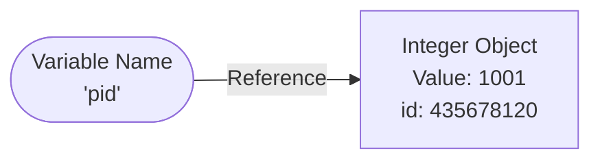
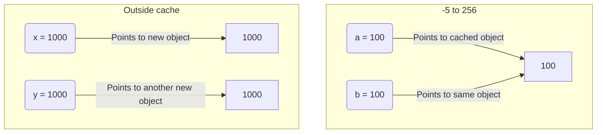

# Module 01: Variables and Memory

Welcome to the foundation of Python programming! Understanding variables and how Python manages memory will help you write bug-free code and answer common interview questions.

## Real-World Analogy: Variables as Sticky Notes
In many programming languages, variables are taught as "boxes" that hold values. **In Python, this is false.**
In Python, variables are like **sticky notes** (labels) attached to objects in memory.

If you write `a = 100`, Python creates a box containing `100` and slaps the sticky note `a` on it.
If you later write `a = 200`, Python creates a NEW box containing `200` and moves the sticky note `a` to the new box. The old `100` box is left behind.

## Variable to Object Reference
Here is a visual representation of how variables point to objects:

## `id()` vs `type()`
Every object in Python has an identity, a type, and a value.

| Function | What it does | Example Output |
| --- | --- | --- |
| `id(variable)` | Returns the memory address (identity) of the object the variable points to. | `435678120` |
| `type(variable)` | Returns the data type of the object. | `<class 'int'>` |

## Python Integer Caching
To save memory and increase performance, Python pre-builds and caches small integers from **-5 to 256**.
When you assign a small integer to a variable, Python doesn't create a new object; it just points the variable to the cached object.

