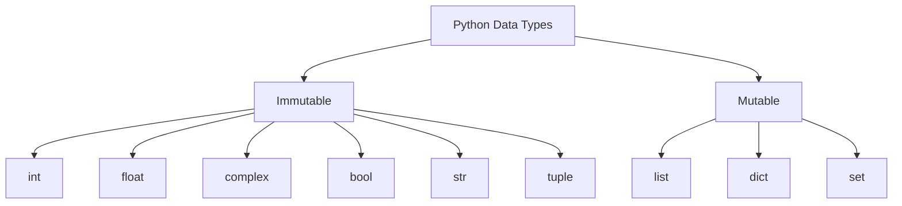
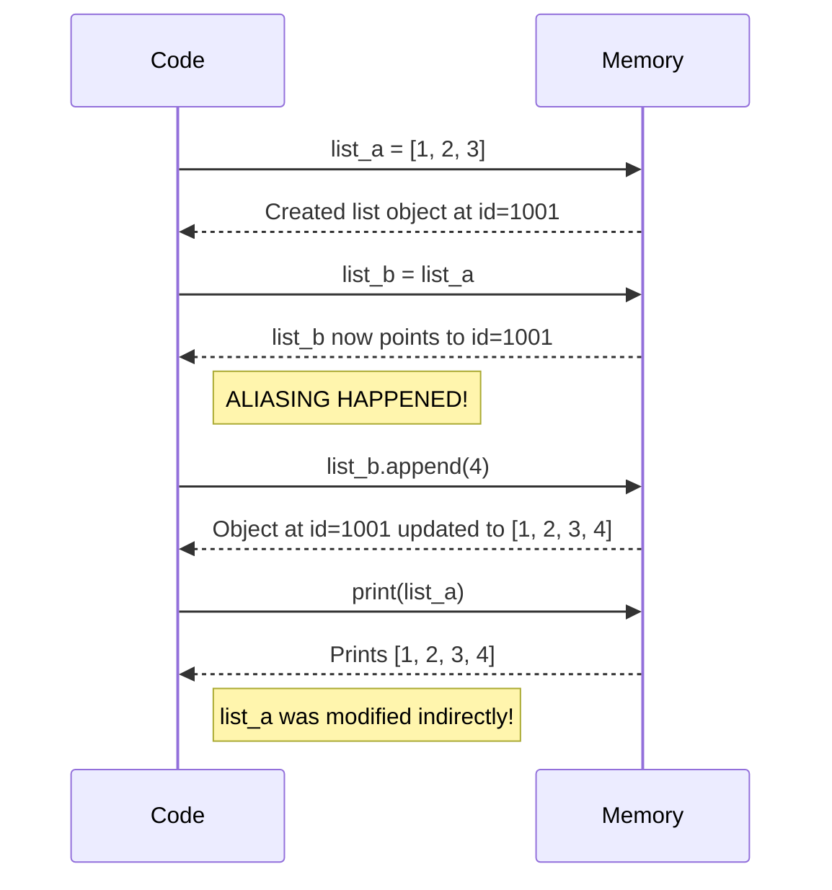

# Module 02: Data Types and Operators

Python has a rich set of built-in data types and operators to manipulate them.

## Data Types Overview

| Category | Type | Example | Mutable? | Notes |
| --- | --- | --- | --- | --- |
| Numeric | `int` | `10` | No | Unlimited precision |
| Numeric | `float` | `10.5` | No | Double precision |
| Numeric | `complex` | `3 + 4j` | No | Uses `j` instead of `i` |
| Boolean | `bool` | `True` | No | Subclass of `int` (True=1, False=0) |
| Text | `str` | `"hello"` | No | Enclosed in single or double quotes |
| Sequence | `list` | `[1, 2, 3]` | **Yes** | Ordered, changeable |
| Sequence | `tuple` | `(1, 2, 3)` | No | Ordered, unchangeable |
| Mapping | `dict` | `{"a": 1}` | **Yes** | Key-value pairs |
| Set | `set` | `{1, 2, 3}` | **Yes** | Unordered, unique items |

## Mutable vs Immutable Data Types

This is one of the most critical concepts in Python.

### The Aliasing Danger with Mutable Types

When you assign a mutable object to a new variable, you don't create a copy. Both variables point to the **same** object in memory.

## Operator Precedence

| Operator | Description |
| --- | --- |
| `**` | Exponentiation (right-associative) |
| `+x`, `-x`, `~x` | Positive, Negative, Bitwise NOT |
| `*`, `/`, `//`, `%` | Multiplication, Division, Floor Division, Modulus |
| `+`, `-` | Addition, Subtraction |

## `is` vs `==`

- `==` checks for **value equality** (Do they have the same contents?).
- `is` checks for **identity** (Are they the exact same object in memory?).
