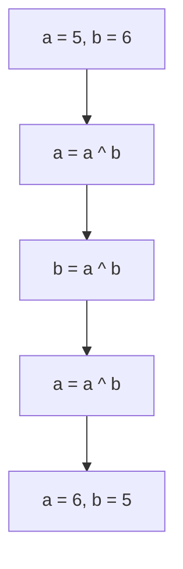
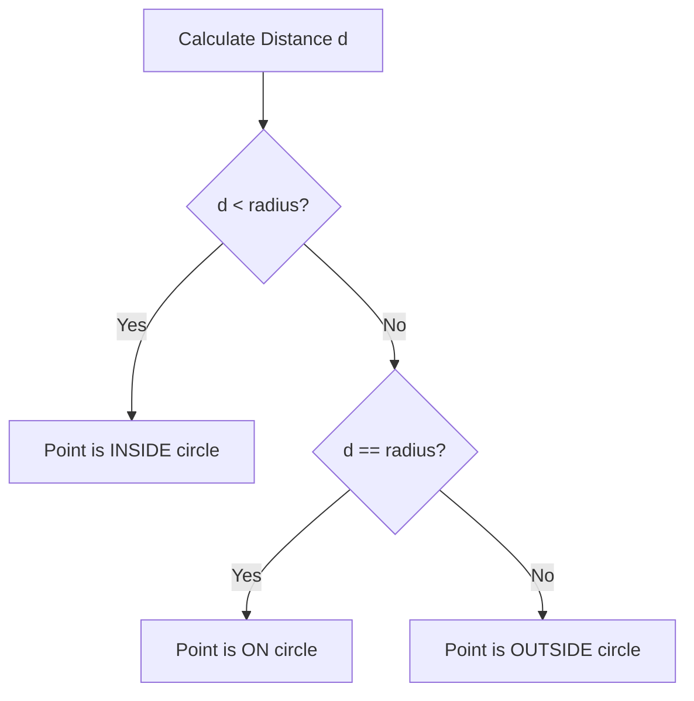

# Module 03: Bitwise Operators and Conditionals

Bitwise operators manipulate numbers at the binary level (bits). They are incredibly fast and are often used in system programming, cryptography, and optimized algorithms.

## Truth Tables

Here are the standard truth tables for AND (`&`), OR (`|`), and XOR (`^`).

| A | B | A & B (AND) | A \| B (OR) | A ^ B (XOR) |
|---|---|---|---|---|
| 0 | 0 | 0 | 0 | 0 |
| 0 | 1 | 0 | 1 | 1 |
| 1 | 0 | 0 | 1 | 1 |
| 1 | 1 | 1 | 1 | 0 |

### Bitwise NOT (`~`)
The NOT operator flips all bits. In Python, `~x` is equivalent to `-(x + 1)`.
Example: `~5` becomes `-6`.

### Shift Operators (`<<`, `>>`)
- **Left Shift (`<<`)**: Shifts bits to the left. `x << y` means $x \times 2^y$.
- **Right Shift (`>>`)**: Shifts bits to the right. `x >> y` means $\lfloor x / 2^y \rfloor$.

## Real-world Uses of Bitwise Operators
- **Flags and Permissions**: Storing multiple boolean flags in a single integer (e.g., Linux file permissions).
- **Networking**: Subnet masking and IP address manipulation.
- **Graphics**: Manipulating color values (RGB).
- **Cryptography**: Fast scrambling of data.

## XOR Swap Trick
You can swap two variables without a temporary variable using XOR.

*Proof:*
1. $a = a \oplus b$
2. $b = (a \oplus b) \oplus b = a \oplus (b \oplus b) = a \oplus 0 = a$
3. $a = (a \oplus b) \oplus a = (a \oplus a) \oplus b = 0 \oplus b = b$

## Decision Trees (Conditionals)

Here is a visual representation of the Circle Point problem using `if/elif/else`:

