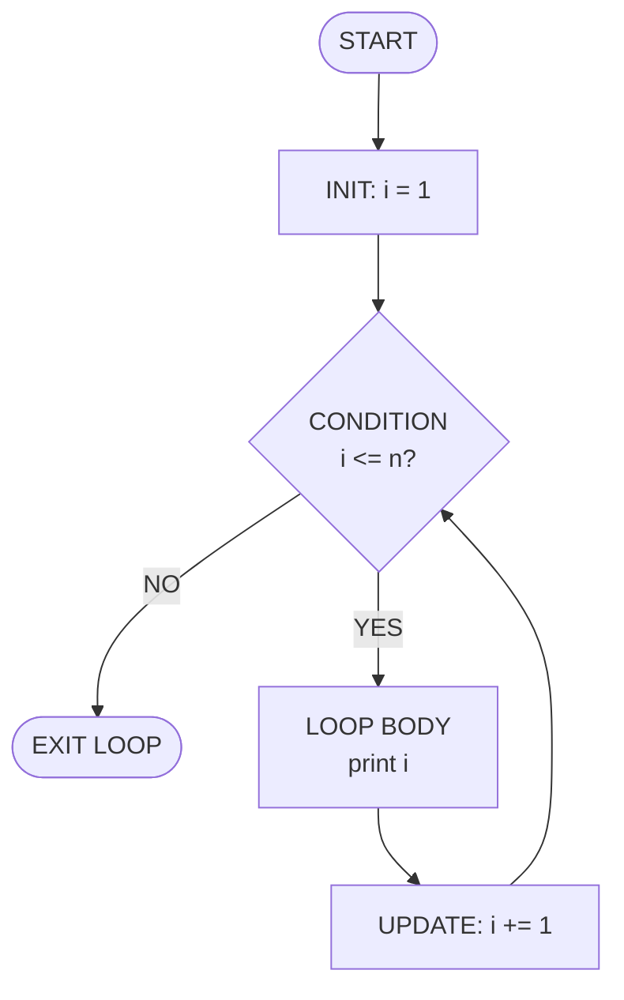
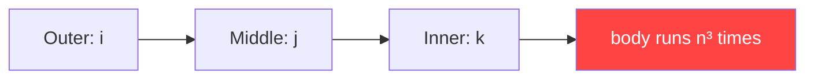
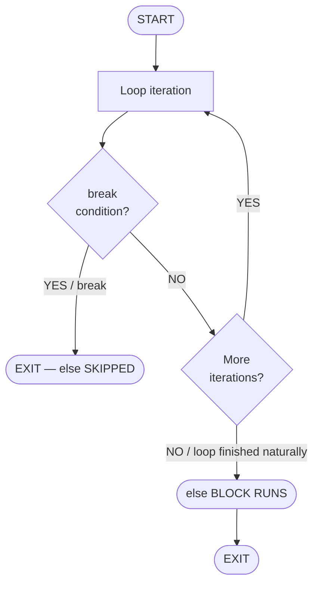
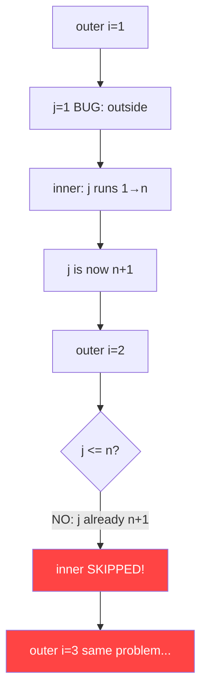

# Module 04 — Loops and Patterns

> **Part of:** Python + DSA Learning Repository · `01_Python_Foundations`

---

## Table of Contents

1. [When to Use `while` vs `for`](#1-when-to-use-while-vs-for)
2. [The Three Loop Components](#2-the-three-loop-components)
3. [While Loop Deep Dive](#3-while-loop-deep-dive)
4. [For Loop Deep Dive](#4-for-loop-deep-dive)
5. [Nested Loops — Grid Mental Model](#5-nested-loops--grid-mental-model)
6. [For-Else / While-Else](#6-for-else--while-else)
7. [Pattern Anatomy](#7-pattern-anatomy)
8. [DSA Problems Covered](#8-dsa-problems-covered)
9. [Big O Complexity Table](#9-big-o-complexity-table)
10. [Real-World Use Cases](#10-real-world-use-cases)
11. [Common Bugs and Fixes](#11-common-bugs-and-fixes)

---

## 1. When to Use `while` vs `for`

| Aspect              | `while`                                    | `for`                                  |
|---------------------|--------------------------------------------|----------------------------------------|
| **Use case**        | Unknown iterations; event-driven stopping  | Known range or iterable                |
| **Variable control**| Manual — you manage INIT, UPDATE yourself  | Automatic — Python advances the cursor |
| **Infinite loop risk** | **High** — forgetting UPDATE is fatal    | Low — range/iterable is bounded        |
| **Readability**     | Better when condition is complex           | Better when iterating a collection     |
| **Typical examples**| Rate limiting, polling, game loops         | Pagination, list processing, counting  |

### Quick Decision Rule

```
Do you know the exact number of iterations?
    YES → for loop
    NO  → while loop (condition-driven)
```

---

## 2. The Three Loop Components

Every correct loop has **exactly three** components:

| Component   | `while` example     | `for` equivalent         |
|-------------|---------------------|--------------------------|
| **INIT**    | `i = 1`             | built into `range(1, …)` |
| **CONDITION** | `while i <= n:`   | built into `range(…, n)` |
| **UPDATE**  | `i += 1`            | automatic step           |

> [!CAUTION]
> Missing **UPDATE** in a `while` loop causes an **infinite loop**. Python will not warn you. Always verify that your loop variable changes every iteration.

---

## 3. While Loop Deep Dive

### 3.1 Execution Flowchart



### 3.2 Trace Table — `while i <= 10`

| `i` | Condition `i<=10` | Action   | `i` after update |
|-----|--------------------|----------|------------------|
| 1   | True               | print 1  | 2                |
| 2   | True               | print 2  | 3                |
| … | …                 | …       | …               |
| 10  | True               | print 10 | 11               |
| 11  | **False**          | EXIT     | —                |

### 3.3 Bitwise Operators Inside Loops

| Expression | Equivalent   | Notes                                              |
|------------|--------------|---------------------------------------------------|
| `i << 2`   | `i * 4`      | Left shift: multiply by 2²                        |
| `i >> 2`   | `i // 4`     | Right shift: integer divide by 2²                 |
| `i & 0xFF` | `i % 256`    | Mask to 8 bits                                    |
| `i ^ j`    | XOR of i, j  | Useful for toggle patterns                        |

> [!WARNING]
> **Operator Precedence Trap:**
> `i + 1 << 2` is evaluated as `i + (1 << 2)` = `i + 4` — **not** `(i + 1) << 2`.
> `+` has **higher** precedence than `<<`. Always use explicit parentheses.

---

## 4. For Loop Deep Dive

### 4.1 `range()` — All Three Forms

```python
range(stop)              # 0, 1, ..., stop-1
range(start, stop)       # start, ..., stop-1
range(start, stop, step) # start, start+step, ... (< stop)
```

| Call                 | Produces                        |
|----------------------|---------------------------------|
| `range(5)`           | `0 1 2 3 4`                     |
| `range(1, 6)`        | `1 2 3 4 5`                     |
| `range(0, 10, 2)`    | `0 2 4 6 8`                     |
| `range(10, 0, -2)`   | `10 8 6 4 2`                    |

> [!NOTE]
> `range()` produces values **lazily** — it uses **O(1) memory** regardless of size.
> It does NOT create a list in memory. Use `list(range(n))` only when you need a list.

### 4.2 Precedence Trap with `>>`

> [!WARNING]
> `i >> 2 + 1` is `i >> (2+1)` = `i >> 3` = `i // 8` — **not** `(i>>2)+1`.
> `+` has **higher** precedence than `>>`. Write `(i >> 2) + 1` explicitly.

---

## 5. Nested Loops — Grid Mental Model

```mermaid
quadrantChart
    title Nested Loop Grid (outer=rows, inner=columns)
    x-axis "Column j →" 0 --> 3
    y-axis "Row i ↓" 0 --> 3
    quadrant-1 (0,3)
    quadrant-2 (3,3)
    quadrant-3 (0,0)
    quadrant-4 (3,0)
```

### ASCII Grid Diagram (n=4)

```
  j→  0      1      2      3
i↓
 0  (0,0)  (0,1)  (0,2)  (0,3)
 1  (1,0)  (1,1)  (1,2)  (1,3)
 2  (2,0)  (2,1)  (2,2)  (2,3)
 3  (3,0)  (3,1)  (3,2)  (3,3)
```

- **Outer loop picks the row** (`i`)
- **Inner loop sweeps the column** (`j`)
- Total iterations = `n × n = n²` → **O(n²)**

### Triple Nested Loop Warning



> [!CAUTION]
> For `n=100`, a triple nested loop runs **1,000,000** iterations.
> Avoid cubic algorithms unless absolutely necessary.

---

## 6. For-Else / While-Else



### When `else` Runs

| Scenario                         | `else` block? |
|----------------------------------|---------------|
| Loop completes all iterations    | ✅ YES         |
| Loop exits via `break`           | ❌ NO          |
| Loop body never executed (empty) | ✅ YES         |

### Practical Example — Prime Check

```python
import math

for i in range(2, int(math.sqrt(n)) + 1):
    if n % i == 0:
        print("Not Prime")
        break           # ← else is SKIPPED
else:
    print("Prime")      # ← runs only if no divisor found
```

> [!TIP]
> The `for-else` pattern is Python's elegant way to express "search and act on failure". It removes the need for a separate `found` boolean flag.

---

## 7. Pattern Anatomy

### 7.1 How the Pyramid Works (mathematically)

For a pyramid of height `n`, at row `i` (1-indexed):

| Component              | Formula      | n=5, row i=3 |
|------------------------|--------------|--------------|
| Leading spaces         | `n - i`      | 2            |
| Stars (always odd)     | `2i - 1`     | 5            |
| Trailing spaces        | `n - i`      | 2            |

```
Row 1: nnnn *            (n-1=4 spaces, 1 star)
Row 2: nnn * * *         (n-2=3 spaces, 3 stars)
Row 3: nn * * * * *      (n-3=2 spaces, 5 stars)
Row 4: n * * * * * * *   (n-4=1 space,  7 stars)
Row 5: * * * * * * * * * (0  spaces,    9 stars)
```

### 7.2 Right-Triangle Pattern Anatomy

For a right-angled triangle, row `i`:
- Stars = `i`
- No spaces needed
- Total cells = 1 + 2 + 3 + … + n = **n(n+1)/2** → O(n²) work

### 7.3 Diamond Pattern (Odd n)

A diamond is a **pyramid** (upper half) stacked on an **inverted pyramid** (lower half).

```
m = ceil(n / 2)            # half-height
Upper: for i in 1..m  → 2i-1 stars, (m-i) spaces
Lower: for i in 1..m-1 → 2(m-i)-1 stars, i spaces
```

---

## 8. DSA Problems Covered

| # | Problem                     | Approach 1          | Approach 2            | Optimal T / S      |
|---|-----------------------------|---------------------|-----------------------|--------------------|
| 1 | First N natural numbers     | `for` loop          | `while` loop          | O(n) / O(1)        |
| 2 | Even numbers 2 to N         | `while` + if check  | `for` step=2          | O(n/2) / O(1)      |
| 3 | Sum of N naturals           | `for` accumulator   | Gauss formula         | **O(1) / O(1)**    |
| 4 | Sum of N given numbers      | index loop          | direct iteration      | O(n) / O(1)        |
| 5 | Arithmetic series           | list append         | list comprehension    | O(n) / O(n)        |
| 6 | Check Prime                 | brute O(n)          | sqrt O(√n)            | **O(√n) / O(1)**   |
| 7 | Sum of digits               | math mod/div        | string conversion     | O(log n) / O(1)    |
| 8 | Sum of even digits          | math mod/div        | —                     | O(log n) / O(1)    |
| 9 | Factorial                   | iterative loop      | —                     | O(n) / O(1)        |
| 10 | Palindrome                 | string slice        | two pointers / math   | O(n) / O(1)        |

---

## 9. Big O Complexity Table

| Pattern / Algorithm           | Time         | Space         | Notes                          |
|-------------------------------|--------------|---------------|--------------------------------|
| Single `while`/`for` loop     | O(n)         | O(1)          | Linear scan                    |
| Loop with step k              | O(n/k) = O(n)| O(1)          | Constant factor, same class    |
| Two nested loops              | O(n²)        | O(1)          | All triangle/grid patterns     |
| Three nested loops            | O(n³)        | O(1)          | Avoid for large n              |
| Sum of naturals (Gauss)       | **O(1)**     | O(1)          | n*(n+1)//2                     |
| Sum of evens (formula)        | **O(1)**     | O(1)          | k*(k+1), k=n//2                |
| Digit sum (math)              | O(log₁₀ n)  | O(1)          | d = number of digits           |
| Digit sum (string)            | O(d)         | O(d)          | d = len(str(n))                |
| Prime check (brute)           | O(n)         | O(1)          | Check all divisors             |
| Prime check (sqrt)            | **O(√n)**    | O(1)          | Check up to √n only            |
| Palindrome (slice)            | O(n)         | O(n)          | Creates reversed string        |
| Palindrome (two pointers)     | O(n)         | **O(1)**      | In-place comparison            |
| Palindrome (math reversal)    | O(log₁₀ n)  | O(1)          | Number reversal                |
| Arithmetic series (list)      | O(n)         | O(n)          | Stores all elements            |

---

## 10. Real-World Use Cases

### Rate Limiting — `while` loop

```python
MAX_REQUESTS = 100
RATE_LIMIT   = 10    # per second window
requests_sent = 0

while requests_sent < MAX_REQUESTS:
    if requests_sent < RATE_LIMIT:
        send_request()
        requests_sent += 1
    else:
        time.sleep(1)   # wait for next window
        requests_sent = 0
```

**Why `while`?** You don't know when the rate limit resets — the loop continues until an external condition changes.

---

### Pagination — `for` loop

```python
TOTAL_PAGES = 50
for page in range(1, TOTAL_PAGES + 1):
    data = fetch_page(page)
    process(data)
```

**Why `for`?** The total number of pages is known upfront. `range` makes the intent clear.

---

### Event Polling — `while` loop

```python
while not event_received():
    poll_event_queue()
    time.sleep(0.1)    # prevent CPU spin
handle_event()
```

**Why `while`?** You poll repeatedly until an unpredictable external event occurs.

---

## 11. Common Bugs and Fixes

### Bug 1: `j` initialized OUTSIDE outer loop (nested while)

```python
# *** BUG: j is never reset — inner loop runs only on first outer pass ***
j = 1                       # ← BUG: set here
i = 1
while i <= n:
    while j <= n:           # j is already > n after first outer pass!
        print("*", end=" ")
        j += 1
    print()
    i += 1
```

```python
# *** FIX: reset j inside outer loop ***
i = 1
while i <= n:
    j = 1                   # ← FIX: reset here every outer iteration
    while j <= n:
        print("*", end=" ")
        j += 1
    print()
    i += 1
```



**Fix trace (j reset inside):**

| outer `i` | `j` resets to | inner runs | Stars printed |
|-----------|---------------|------------|---------------|
| 1         | 1             | j=1,2,3    | * * *         |
| 2         | 1             | j=1,2,3    | * * *         |
| 3         | 1             | j=1,2,3    | * * *         |

---

### Bug 2: Missing UPDATE → Infinite Loop

```python
# *** BUG: no update — infinite loop ***
i = 1
while i <= 10:
    print(i)
    # i += 1  ← MISSING — i stays 1 forever
```

```python
# *** FIX ***
i = 1
while i <= 10:
    print(i)
    i += 1    # ← FIX: always update
```

---

### Bug 3: Operator Precedence with `<<` and `>>`

```python
# *** BUG: parsed as i + (1 << 2) = i + 4 ***
result = i + 1 << 2

# *** FIX: use parentheses ***
result = (i + 1) << 2
```

---

> [!TIP]
> **Golden Rules for Loop Correctness:**
> 1. Every `while` loop needs INIT + CONDITION + UPDATE.
> 2. Every nested `while` loop needs its inner variable reset **inside** the outer loop.
> 3. Use explicit parentheses around bitwise expressions — never rely on precedence memory.
> 4. Use `for-else` instead of a `found` flag for search problems.
> 5. Prefer `O(√n)` prime check over `O(n)` brute force.
