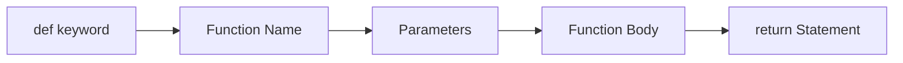
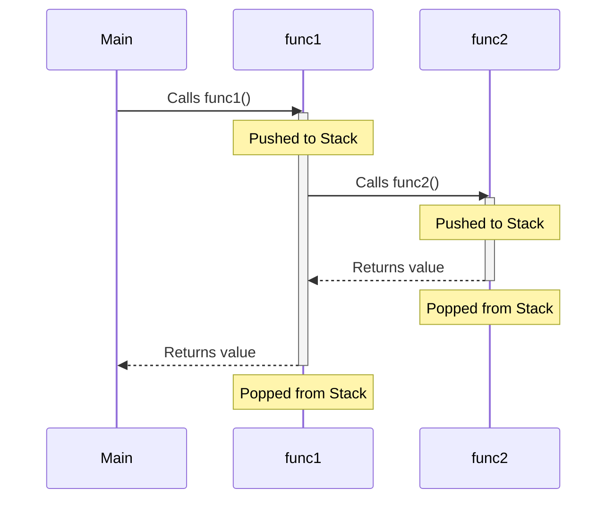

# Module 05: Functions and Scope

Functions are reusable blocks of code that perform a specific task. They are essential for breaking down complex problems into manageable pieces.

## Why Functions Matter
1. **Modularity**: Break large programs into smaller chunks.
2. **Reusability**: Write once, use many times.
3. **Readability**: Code becomes self-documenting with good function names.
4. **Testing**: Easier to isolate and test small pieces of logic.
5. **Abstraction**: Hide complex implementation details from the caller.

## Function Anatomy



**Parameters vs Arguments:**
- **Parameters**: The variables defined in the function signature (placeholders).
- **Arguments**: The actual values passed to the function when it is called.

## `return` vs `print()`

This is a common beginner confusion. `print()` displays text on the screen for humans to read. `return` sends data back to the code that called the function so it can be used in further calculations.

| Feature | `return` | `print()` |
| --- | --- | --- |
| **Purpose** | Send data back to the caller | Display text on screen |
| **What the caller gets** | The actual computed value | `None` |
| **Use case** | Math calculations, data processing | Debugging, user feedback |

## The Call Stack
When a function calls another function, Python uses a "Call Stack" to keep track of where it is. It works like a stack of plates: last in, first out (LIFO).



## Global vs Local Scope

```mermaid
flowchart TD
    subgraph Global Scope
        G(global_var)
    end
    
    subgraph Local Scope [Inside Function]
        L(local_var)
    end
    
    L -.-> |Can read| G
    G -.x |Cannot access| L
```
Use the `global` keyword to modify global variables from inside a function, but it's generally considered bad practice. Prefer passing arguments and returning values.

## Operator Precedence

| Operator | Associativity | Example |
| --- | --- | --- |
| `**` (Exponentiation) | **Right-to-Left** | `2**3**2` = $2^{(3^2)}$ = $2^9$ = 512 |
| `*`, `/`, `//`, `%` | Left-to-Right | `10 / 2 * 5` = 25.0 |
| `+`, `-` | Left-to-Right | `10 - 2 + 5` = 13 |

## Prime Checking Approaches

| Approach | Time Complexity | Space Complexity | Notes |
| --- | --- | --- | --- |
| 1. For-Else Loop | $O(n)$ | $O(1)$ | Checks all numbers up to $n$ |
| 2. While Loop $\sqrt{n}$ | $O(\sqrt{n})$ | $O(1)$ | Math property: if $n=a \times b$, one factor $\le \sqrt{n}$ |
| 3. Optimized Function | $O(\sqrt{n})$ | $O(1)$ | Best practice: reusable, fast, handles edge cases |
