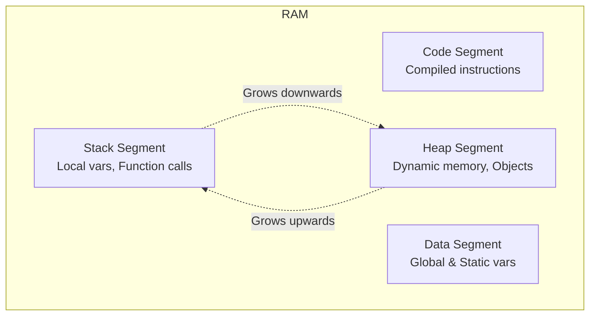
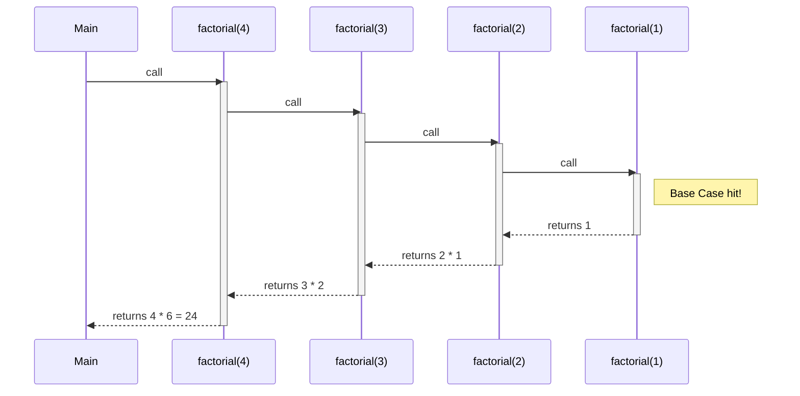
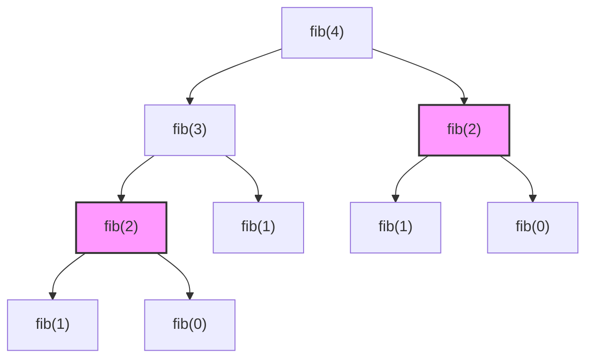

# Module 06: Recursion

Recursion is a method where the solution to a problem depends on solutions to smaller instances of the same problem. A recursive function calls itself until it reaches a base case.

## Analogies
- **Russian Nesting Dolls**: Open a doll, find a smaller one, repeat until you find the solid one (base case).
- **Dictionary Lookup**: Look up a word, its definition has a word you don't know, look up that word... repeat until you find a word you know, then work backwards.

## Memory Segments

When a program runs, it uses memory divided into several segments:

## The Call Stack

Every time a function is called, an "Activation Record" (or stack frame) is pushed onto the Stack. It stores local variables and where to return to.

## The Leap of Faith Template

> [!TIP]
> When writing recursive functions, follow this 3-step template:
> 1. **Base Case**: What is the simplest, smallest input that requires no calculation? (Stops the recursion)
> 2. **Recursive Work**: Do the small amount of work for the current step.
> 3. **Leap of Faith**: Call the function itself on a *smaller* input, assuming it will work correctly. Combine the result with step 2.

## Fibonacci Recursion Tree

The naive recursive Fibonacci calculates the same values over and over, leading to $O(2^n)$ time complexity.

*Notice how `fib(2)` is calculated twice!*

## Complexity Table

| Pattern | Calls per level | Depth | Time Complexity | Space Complexity |
| --- | --- | --- | --- | --- |
| `f(n-1)` | 1 | $n$ | $O(n)$ | $O(n)$ |
| `f(n/2)` | 1 | $\log n$ | $O(\log n)$ | $O(\log n)$ |
| `f(n-1) + f(n-2)` | 2 | $n$ | $O(2^n)$ | $O(n)$ |

## Recursion vs Iteration

| Feature | Recursion | Iteration (Loops) |
| --- | --- | --- |
| **Code Length** | Usually shorter, elegant | Usually longer |
| **Memory** | Uses Stack memory $O(n)$, risk of Overflow | Uses $O(1)$ memory, no overflow |
| **Speed** | Slower (function call overhead) | Faster |
| **Best For** | Trees, graphs, divide & conquer | Simple sequences, flat arrays |
