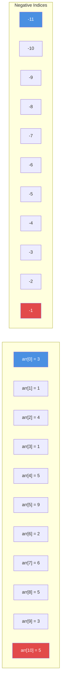
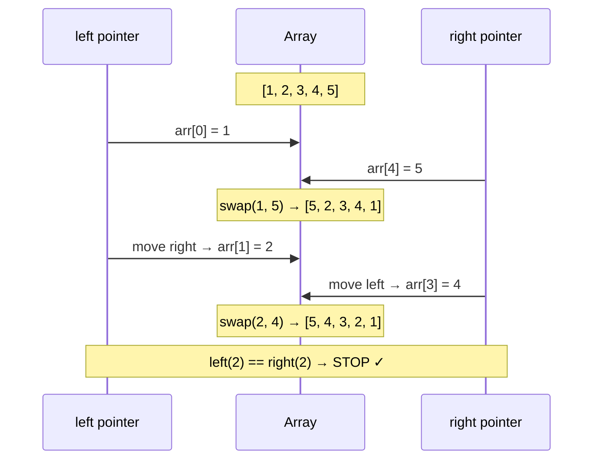
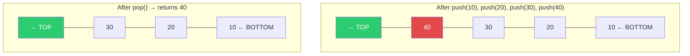
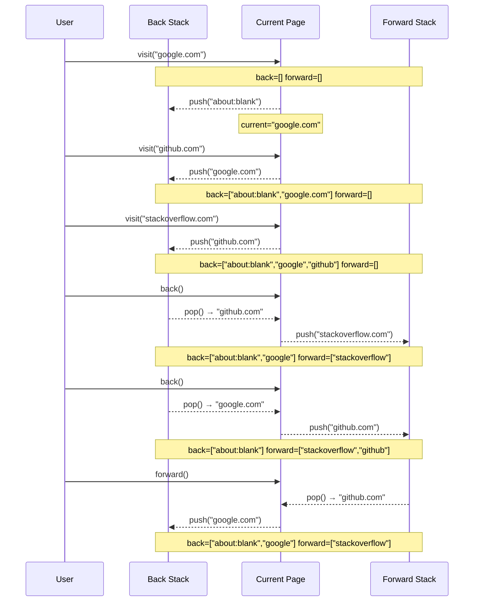
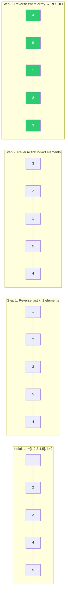

# Module 07 — Data Structures: Arrays & Stacks

> **Python Learning Repository** · `01_Python_Foundations/07_Data_Structures_Arrays/`

---

## Table of Contents

| # | Topic |
|---|-------|
| 1 | [What Is an Array?](#1-what-is-an-array) |
| 2 | [Array Indexing & Negative Indices](#2-array-indexing--negative-indices) |
| 3 | [Traversal, Sum, Max, Min](#3-traversal-sum-max-min) |
| 4 | [First Occurrence](#4-first-occurrence-of-an-element) |
| 5 | [Last Occurrence](#5-last-occurrence-of-an-element) |
| 6 | [All Occurrences](#6-all-occurrences-of-an-element) |
| 7 | [Reverse an Array](#7-reverse-an-array) |
| 8 | [Rotate by 1](#8-rotate-array-by-1) |
| 9 | [Rotate by K](#9-rotate-array-by-k-positions) |
| 10 | [Maximum of 3 / Largest of N](#10-maximum-of-3--largest-of-n) |
| 11 | [Stack Data Structure](#11-the-stack-data-structure) |
| 12 | [Use Case 1 — Browser History](#12-use-case-1--browser-history-stack) |
| 13 | [Use Case 2 — Valid Parentheses](#13-use-case-2--valid-parentheses-stack) |
| 14 | [Use Case 3 — Reverse Polish Notation](#14-use-case-3--reverse-polish-notation-postfix-evaluation) |
| 15 | [Use Case 4 — Friend Recommendation (Graph)](#15-use-case-4--fb-friend-recommendation-graph) |
| 16 | [Big-O Reference Tables](#16-big-o-reference-tables) |
| 17 | [Practice Challenges](#17-practice-challenges) |

---

## 1. What Is an Array?

An **array** is a **linear data structure** — a container that stores a sequence of values in contiguous memory, all referenced by a single name.

**Key properties:**
- Elements are stored sequentially in memory
- Access any element in **O(1)** time using its index
- Insertion/deletion in the middle is **O(n)** (elements shift)

In Python, the two built-in array-like types are:

| Type | Mutable? | Example |
|------|----------|---------|
| `list` | ✅ Yes | `[1, 2, 3]` |
| `tuple` | ❌ No | `(1, 2, 3)` |

> Python lists are **dynamic arrays** — they resize automatically under the hood. This makes them slightly different from fixed-size arrays in C/Java, but the algorithmic logic is identical.

---

## 2. Array Indexing & Negative Indices

### Mermaid Diagram 1 — Array Indexing



```
arr  = [ 3,  1,  4,  1,  5,  9,  2,  6,  5,  3,  5 ]
pos    =  0   1   2   3   4   5   6   7   8   9  10
neg    =-11 -10  -9  -8  -7  -6  -5  -4  -3  -2  -1
              ↑                                    ↑
          arr[-11]                             arr[-1]
          = arr[0]                           = arr[10]
          = 3                                = 5
```

**Key rule:**  `arr[i]` = `arr[i + n]` = `arr[i - n]` for any integer `i` (where `n = len(arr)`)

---

## 3. Traversal, Sum, Max, Min

All four operations require a single pass through the array → **O(n) time, O(1) space**.

### Traversal Methods

```python
# Method 1: while loop (explicit index control)
i = 0
while i < len(arr):
    print(arr[i])
    i += 1

# Method 2: for-in (Pythonic, no index needed)
for num in arr:
    print(num)

# Method 3: range() (when index is needed)
for i in range(len(arr)):
    print(arr[i])

# Method 4: enumerate() (index + value together)
for i, num in enumerate(arr):
    print(i, num)
```

### Sum / Max / Min

```python
# Manual sum
total = 0
for num in arr:
    total += num          # O(n)

# Manual max — initialise with -infinity so ANY value beats it
max_val = float('-inf')
for num in arr:
    if num > max_val:
        max_val = num     # O(n)

# Python built-ins (same O(n) internally, but cleaner)
sum(arr), max(arr), min(arr)
```

---

## 4. First Occurrence of an Element

**Problem:** Find the index of the first element equal to `target`. Return `-1` if not found.

### Approach 1 — Linear Scan (Brute Force)

```
arr = [3, 1, 4, 1, 5, 9, 2, 6, 5, 3, 5]  target = 5

i=0: arr[0]=3 ≠ 5  skip
i=1: arr[1]=1 ≠ 5  skip
i=2: arr[2]=4 ≠ 5  skip
i=3: arr[3]=1 ≠ 5  skip
i=4: arr[4]=5 == 5  → RETURN 4 ✓
```

**TIME: O(n) · SPACE: O(1)**

### Approach 2 — Binary Search (Only for Sorted Arrays)

```
sorted_arr = [1, 1, 2, 3, 3, 4, 5, 5, 5, 6, 9]  target = 5

left=0, right=10
mid=5: arr[5]=4 < 5 → move left to 6
mid=8: arr[8]=5 == 5 → record result=8, search LEFT (right=7)
mid=6: arr[6]=5 == 5 → record result=6, search LEFT (right=5)
left > right → STOP → return 6 ✓
```

**TIME: O(log n) · SPACE: O(1)**

> **When to use which?**
> - Unsorted array → Linear scan O(n) is the best possible
> - Sorted array → Binary search O(log n) is faster

---

## 5. Last Occurrence of an Element

Scan **backwards** from the end using `range(n-1, -1, -1)`.

```python
def last_occurrence(arr, n, target):
    for i in range(n - 1, -1, -1):   # n-1 down to 0
        if arr[i] == target:
            return i
    return -1
```

```
arr = [3, 1, 4, 1, 5, 9, 2, 6, 5, 3, 5]  target = 5
i=10: arr[10]=5 == 5 → RETURN 10 ✓   (hits first going backwards)
```

**TIME: O(n) · SPACE: O(1)**

---

## 6. All Occurrences of an Element

Collect **every** matching index into a result list.

```python
def all_occurrences(arr, target):
    indices = []
    for i, num in enumerate(arr):
        if num == target:
            indices.append(i)
    return indices if indices else [-1]

# arr=[3,1,4,1,5,9,2,6,5,3,5], target=5  → [4, 8, 10]
```

**TIME: O(n) · SPACE: O(k)** where k = number of occurrences

---

## 7. Reverse an Array

### Mermaid Diagram 2 — Two-Pointer Reversal



```
[1, 2, 3, 4, 5]
 ↑           ↑     swap arr[left] ↔ arr[right], move inward
 L           R

Step 1: swap(1,5) → [5, 2, 3, 4, 1]   L=1, R=3
Step 2: swap(2,4) → [5, 4, 3, 2, 1]   L=2, R=2 → STOP
```

| Approach | Strategy | Time | Space |
|----------|----------|------|-------|
| Brute Force | Build new reversed list | O(n) | **O(n)** |
| **Optimal** | Two-pointer in-place swap | O(n) | **O(1)** ✅ |

```python
def reverse_inplace(arr):
    i, j = 0, len(arr) - 1
    while i < j:
        arr[i], arr[j] = arr[j], arr[i]   # Python swap (no temp needed!)
        i += 1
        j -= 1
```

---

## 8. Rotate Array by 1

**Right-rotate by 1** = last element moves to the front, everything else shifts right.

```
Before: [3, 1, 4, 1, 5]
After:  [5, 3, 1, 4, 1]   ← 5 wraps around
```

```python
def rotate_by_1(arr, n):
    temp = arr[-1]                 # save the last element
    for i in range(n-1, 0, -1):
        arr[i] = arr[i-1]          # shift right
    arr[0] = temp                  # place saved element at front
```

**TIME: O(n) · SPACE: O(1)**

---

## 9. Rotate Array by K Positions

### Approach 1 — Brute Force: Call Rotate-by-1, K Times

```python
for _ in range(k):
    rotate_by_1(arr, n)
```

**TIME: O(n × k) — can be O(n²) if k ≈ n**

### Approach 2 — Optimal: Three-Reversal Trick

**Trace for `arr = [1, 2, 3, 4, 5]`, `k = 2`:**

```
Initial:                 [1, 2, 3, 4, 5]

Step 1: rev last k=2     [1, 2, 3, 5, 4]
        indices [n-k .. n-1] = [3..4]

Step 2: rev first n-k=3  [3, 2, 1, 5, 4]
        indices [0 .. n-k-1] = [0..2]

Step 3: rev entire        [4, 5, 1, 2, 3] ✓
        indices [0 .. n-1]
```

```python
def reverse_segment(arr, left, right):
    while left < right:
        arr[left], arr[right] = arr[right], arr[left]
        left += 1
        right -= 1

def k_rotate(arr, k):
    n = len(arr)
    k = k % n                       # handle k > n
    reverse_segment(arr, n-k, n-1)  # Step 1
    reverse_segment(arr, 0, n-k-1)  # Step 2
    reverse_segment(arr, 0, n-1)    # Step 3
```

**TIME: O(n) · SPACE: O(1)** — three passes but each is O(n)

---

## 10. Maximum of 3 / Largest of N

### Max of 3 — O(1)

```python
def max_of_3(a, b, c):
    if a > b and a > c: return a
    elif b > c:         return b
    else:               return c
```

### Largest of N — O(n)

```python
largest = arr[0]                   # assume first is largest
for num in arr:
    if num > largest:
        largest = num
# Or simply: max(arr)
```

---

## 11. The Stack Data Structure

### Mermaid Diagram 3 — Stack Push & Pop



### LIFO — Last In, First Out

> Think of a **stack of plates**: you can only add or remove from the **top**.

| Operation | Description | Time Complexity |
|-----------|-------------|-----------------|
| `push(item)` | Add item to top | **O(1)** amortized |
| `pop()` | Remove & return top item | **O(1)** |
| `peek()` | View top item (no removal) | **O(1)** |
| `is_empty()` | Check if stack has items | **O(1)** |
| `size()` | Number of items | **O(1)** |

### Python List as Stack

```python
stack = []
stack.append(10)   # push
stack.append(20)
stack.append(30)

top = stack[-1]    # peek — O(1)
val = stack.pop()  # pop  — O(1), returns 30
```

### Full Stack Class

```python
class Stack:
    def __init__(self):
        self.items = []

    def push(self, item):
        self.items.append(item)           # O(1) amortized

    def pop(self):
        if self.is_empty():
            return None
        return self.items.pop()           # O(1)

    def peek(self):
        return self.items[-1] if not self.is_empty() else None

    def is_empty(self):
        return len(self.items) == 0

    def size(self):
        return len(self.items)

    def __str__(self):
        return f"Stack(bottom→top): {self.items}"
```

---

## 12. Use Case 1 — Browser History (Stack)

### Mermaid Diagram 4 — Browser Navigation Sequence



### Implementation Key

```python
class BrowserHistory:
    def __init__(self, homepage):
        self._back    = Stack()
        self._forward = Stack()
        self._current = homepage

    def visit(self, url):
        self._back.push(self._current)
        self._current = url
        self._forward = Stack()           # clear forward history

    def back(self):
        if self._back.is_empty(): return self._current
        self._forward.push(self._current)
        self._current = self._back.pop()
        return self._current

    def forward(self):
        if self._forward.is_empty(): return self._current
        self._back.push(self._current)
        self._current = self._forward.pop()
        return self._current
```

**TIME: O(1) per operation · SPACE: O(n)** total pages visited

---

## 13. Use Case 2 — Valid Parentheses (Stack)

### Why Counting Fails (Brute Force Problem)

```python
# BRUTE FORCE — Count opens and closes
# FAILS for ')(': count matches but ORDER is wrong!
def is_valid_brute(s):
    return s.count('(') + s.count('{') + s.count('[') == \
           s.count(')') + s.count('}') + s.count(']')

is_valid_brute(")(")   # → True  ❌ WRONG
is_valid_brute("({[})")# → True  ❌ WRONG
```

### Optimal Stack Approach

```
TRACE for "({[]})":
  char='('  → push   → stack=['(']
  char='{'  → push   → stack=['(', '{']
  char='['  → push   → stack=['(', '{', '[']
  char=']'  → pop=[ matches ] ✓  → stack=['(', '{']
  char='}'  → pop={ matches } ✓  → stack=['(']
  char=')'  → pop=( matches ) ✓  → stack=[]
  stack empty → return True ✓
```

```python
def is_valid_parentheses(s):
    bracket_map = {')': '(', '}': '{', ']': '['}
    stack = []
    for char in s:
        if char in bracket_map:                    # closing bracket
            top = stack.pop() if stack else '#'
            if bracket_map[char] != top:
                return False                       # mismatch
        else:
            stack.append(char)                     # opening → push
    return len(stack) == 0                         # must be fully matched
```

| Test Case | Expected | Brute Force | Stack |
|-----------|----------|-------------|-------|
| `"({[]})"`| `True`   | ✅ True     | ✅ True |
| `"({[})"` | `False`  | ❌ **True** | ✅ False |
| `")("`    | `False`  | ❌ **True** | ✅ False |
| `"(("`    | `False`  | ✅ False    | ✅ False |

**TIME: O(n) · SPACE: O(n)**

---

## 14. Use Case 3 — Reverse Polish Notation (Postfix Evaluation)

### What Is Postfix?

| Notation | Format | Example |
|----------|--------|---------|
| **Infix** | `op` between operands | `2 + 3` |
| **Prefix** | `op` before operands | `+ 2 3` |
| **Postfix (RPN)** | `op` after operands | `2 3 +` |

Postfix eliminates the need for parentheses — **precedence is baked into position**.

### Algorithm

```
Rule 1: Number   → PUSH onto stack
Rule 2: Operator → POP op2, POP op1, compute op1 OP op2, PUSH result

TRACE for ["2", "1", "+", "3", "*"]:
  "2" → push → [2]
  "1" → push → [2, 1]
  "+" → pop 1(op2), pop 2(op1) → push 2+1=3 → [3]
  "3" → push → [3, 3]
  "*" → pop 3(op2), pop 3(op1) → push 3×3=9 → [9]
  Result = 9   ← (2+1)×3 = 9 ✓
```

```python
def evaluate_postfix(tokens):
    stack = []
    operators = {'+', '-', '*', '/'}
    for token in tokens:
        if token not in operators:
            stack.append(int(token))
        else:
            op2, op1 = stack.pop(), stack.pop()
            if   token == '+': stack.append(op1 + op2)
            elif token == '-': stack.append(op1 - op2)
            elif token == '*': stack.append(op1 * op2)
            elif token == '/': stack.append(int(op1 / op2))
    return stack.pop()
```

**TIME: O(n) · SPACE: O(n)**

### Test Cases

| Tokens | Expression | Result |
|--------|-----------|--------|
| `["2","1","+","3","*"]` | (2+1)×3 | **9** |
| `["4","13","5","/","+"]` | 4+(13÷5) | **6** |
| `["2","3","+","4","*"]` | (2+3)×4 | **20** |

---

## 15. Use Case 4 — FB Friend Recommendation (Graph)

### Graph as Adjacency List

```
alice  → [bob, carol]
bob    → [alice, dave]
carol  → [alice, dave]
dave   → [bob, carol, eve]
eve    → [dave]
```

**Recommendation Rule:** friends-of-friends who are **not already your friend** and **not yourself**.

### Approach 1 — Brute Force: O(n²) List Membership

```python
def recommend_brute(graph, person):
    my_friends = graph[person]          # list
    recommendations = []
    for friend in my_friends:
        for fof in graph[friend]:
            if fof != person and fof not in my_friends:  # O(n) each!
                if fof not in recommendations:
                    recommendations.append(fof)
    return recommendations
```

**TIME: O(n²) · SPACE: O(n)**

### Approach 2 — Optimal: O(n) Set Lookup

```python
def recommend_optimal(graph, person):
    my_friends = set(graph[person])     # set: O(1) lookup ← KEY CHANGE
    recommendations = set()
    for friend in my_friends:
        for fof in graph[friend]:
            if fof != person and fof not in my_friends:  # O(1) now!
                recommendations.add(fof)
    return sorted(recommendations)
```

**TIME: O(n) · SPACE: O(n)**

> The only change: convert `my_friends` from a `list` to a `set`. One line change = 10× speedup for large networks!

---

## 16. Big-O Reference Tables

### Array Operations — Complete Reference

| Operation | Approach | Time | Space | Notes |
|-----------|----------|------|-------|-------|
| Access by index | `arr[i]` | **O(1)** | O(1) | Direct memory address |
| Traversal | for loop | O(n) | O(1) | Single pass |
| Search (unsorted) | Linear scan | O(n) | O(1) | Must check all |
| Search (sorted) | Binary search | **O(log n)** | O(1) | Halve each step |
| Insert at end | `arr.append()` | **O(1)** amortized | O(1) | |
| Insert at middle | Shift elements | O(n) | O(1) | All elements after shift |
| Delete at end | `arr.pop()` | **O(1)** | O(1) | |
| Delete at middle | Shift elements | O(n) | O(1) | |
| Reverse (copy) | New list | O(n) | **O(n)** | Extra memory |
| Reverse (in-place) | Two pointers | O(n) | **O(1)** | Preferred |
| Rotate by 1 | Shift | O(n) | O(1) | |
| K-rotate (brute) | k × rotate-by-1 | O(n×k) | O(1) | Slow for large k |
| K-rotate (optimal) | Three reversals | O(n) | O(1) | Always use this |

### Stack vs Queue vs Array

| Feature | Array (list) | Stack | Queue |
|---------|-------------|-------|-------|
| Access pattern | Random (any index) | LIFO (top only) | FIFO (front only) |
| Push/Enqueue | O(1) amortized | O(1) | O(1) |
| Pop/Dequeue | O(1) | O(1) | O(1) with `deque` |
| Peek | O(1) | O(1) | O(1) |
| Use cases | General storage | Undo, brackets, DFS | BFS, task scheduling |
| Python type | `list` | `list` | `collections.deque` |

### Algorithms in This Module — Summary

| Algorithm | Time | Space |
|-----------|------|-------|
| Sum / Max / Min | O(n) | O(1) |
| First occurrence (linear) | O(n) | O(1) |
| First occurrence (binary, sorted) | O(log n) | O(1) |
| Last occurrence | O(n) | O(1) |
| All occurrences | O(n) | O(k) |
| Reverse (two-pointer) | O(n) | **O(1)** |
| Rotate by 1 | O(n) | O(1) |
| K-rotate (brute) | O(n×k) | O(1) |
| K-rotate (three-reversal) | O(n) | **O(1)** |
| Max of 3 | O(1) | O(1) |
| Largest of N | O(n) | O(1) |
| Stack push/pop/peek | O(1) | O(1) |
| Valid parentheses | O(n) | O(n) |
| Postfix evaluation | O(n) | O(n) |
| Friend recommendation (brute) | O(n²) | O(n) |
| Friend recommendation (sets) | O(n) | O(n) |

---

## 17. Practice Challenges

> See `07_data_structures_arrays.py` → `# === PRACTICE ZONE ===` section.

| # | Challenge | Key Concept |
|---|-----------|-------------|
| 1 | Second largest element (no sort) | Two-variable tracking |
| 2 | Remove duplicates in-place (sorted array) | Slow/fast two pointers |
| 3 | Min Stack — get_min() in O(1) | Parallel min-tracking stack |
| 4 | Left-rotate by k (three-reversal) | Variation of rotate trick |
| 5 | Evaluate PREFIX expression | Stack + right-to-left scan |
| 6 | Extend BrowserHistory with clear_history() | Stack manipulation |

---

## Mermaid Diagram 5 — Three-Reversal K-Rotate Walkthrough



---

## Quick Reference Card

```
ARRAYS
  Access    arr[i]           O(1)
  Search    linear scan      O(n)
  Search    binary search    O(log n)  ← sorted only
  Reverse   two-pointer      O(n) / O(1) space
  K-rotate  three-reversal   O(n) / O(1) space

STACK  (Python list)
  push  →  list.append(x)   O(1)
  pop   →  list.pop()       O(1)
  peek  →  list[-1]         O(1)

REAL-WORLD STACK USES
  • Browser back/forward history
  • Undo/Redo in text editors
  • Valid brackets matching
  • Postfix expression evaluation
  • Function call stack (recursion)
  • DFS graph traversal
```

---

*Module 07 — Data Structures: Arrays & Stacks*
*Part of: Python + DSA Learning Repository*
