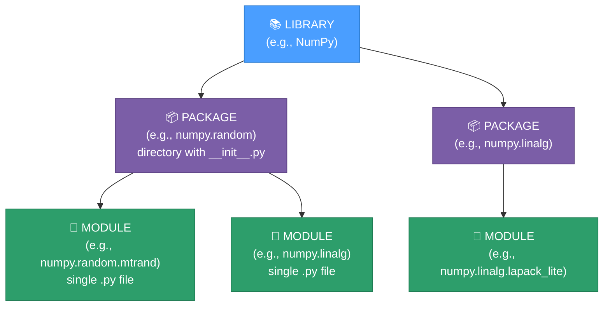
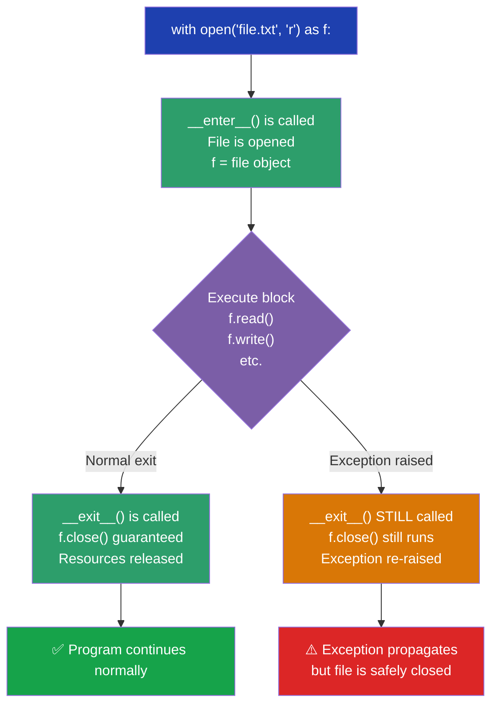

# Module 08: Modules and File Handling

## Overview

File handling lets your Python programs **persist data beyond a single run**. Variables disappear when a program ends — files keep data permanently on disk. This module covers the complete Python file ecosystem: how code is organized (Library → Package → Module), how to import that code, how the `os` and `webbrowser` modules work, every file mode, common operations, and a real mini-project combining files + dictionaries.

---

## 1. Library → Package → Module Hierarchy



| Level | Description | Examples |
|-------|-------------|---------|
| **Library** | Collection of packages; the largest unit | NumPy, TensorFlow, scikit-learn, pandas |
| **Package** | Collection of modules; a directory with `__init__.py` | `numpy.random`, `matplotlib.pyplot` |
| **Module** | A single `.py` file | `math`, `os`, `time`, `json` |

**Two types of modules:**
- **Predefined** — already in Python: `math`, `os`, `sys`, `time`, `webbrowser`
- **User-defined** — any `.py` file you create; importable by other files

---

## 2. Import Styles Comparison

| Style | Syntax | Namespace Result | Best For |
|-------|--------|-----------------|----------|
| **Full module** | `import os` | `os.getcwd()` | Clean namespace; origin is always clear |
| **Specific name** | `from os import getcwd` | `getcwd()` | Convenience when used many times |
| **Alias** | `import numpy as np` | `np.array()` | Long module names used constantly |
| **Wildcard** ❌ | `from os import *` | `getcwd()` | **Avoid** — pollutes namespace |

```python
# Style 1 — full module (recommended for clarity)
import os
os.getcwd()

# Style 2 — specific names (convenient for frequent use)
from os.path import join, exists
join("data", "input.txt")   # no prefix needed

# Style 3 — alias (industry convention)
import numpy as np           # np.array() instead of numpy.array()
import pandas as pd          # pd.DataFrame() instead of pandas.DataFrame()
```

> [!TIP]
> Use `import os` (not `from os import *`) so code readers can always tell where a function came from.

---

## 3. OS Module Common Functions

```python
import os

os.getcwd()             # Current working directory
os.listdir(".")         # Files/folders in a directory
os.mkdir("new_folder")  # Create a directory
os.remove("file.txt")   # Delete a file
os.rename("a", "b")     # Rename a file
os.path.exists(path)    # True/False — does path exist?
os.path.join(a, b)      # Safe cross-platform path joining
os.path.abspath(path)   # Absolute path from relative
os.path.basename(path)  # Just the filename from a full path
os.system(command)      # Run a shell command
```

### Cross-Platform OS Commands

| Task | Windows | macOS | Linux |
|------|---------|-------|-------|
| Open Notepad/TextEdit | `os.system("notepad")` | `os.system("open -a TextEdit")` | `os.system("gedit")` |
| Open Chrome | `os.system("chrome")` | `os.system("open -a 'Google Chrome'")` | `os.system("google-chrome")` |
| List files | `os.system("dir")` | `os.system("ls")` | `os.system("ls")` |
| Clear terminal | `os.system("cls")` | `os.system("clear")` | `os.system("clear")` |

> [!IMPORTANT]
> Use `os.path.join("data", "file.txt")` instead of hardcoding `"data/file.txt"` or `"data\\file.txt"` — `os.path.join()` picks the right separator automatically.

---

## 4. webbrowser Module & Bug Fix

```python
import webbrowser

# *** BUG:  webbrowser.open("https:www.google.com")
#           Missing // after the colon!

# *** FIX:  URL format is  protocol :// host
webbrowser.open("https://www.google.com")          # default browser
webbrowser.open_new("https://www.github.com")      # new window
webbrowser.open_new_tab("https://python.org")      # new tab
```

> [!WARNING]
> The URL must include `://` — `"https:www.google.com"` (missing `//`) is a broken URL. The browser cannot resolve it as a web address.

---

## 5. File Mode Comparison Table

| Mode | Creates file? | Overwrites existing? | Pointer starts at | Can Read? | Can Write? |
|------|:---:|:---:|:---:|:---:|:---:|
| `"r"` | ❌ | ❌ | Beginning | ✅ | ❌ |
| `"w"` | ✅ | ✅ (erases all!) | Beginning | ❌ | ✅ |
| `"a"` | ✅ | ❌ (appends) | **End** | ❌ | ✅ |
| `"r+"` | ❌ | Overwrites at pointer | Beginning | ✅ | ✅ |
| `"w+"` | ✅ | ✅ (erases all!) | Beginning | ✅ | ✅ |
| `"a+"` | ✅ | ❌ (appends) | **End** | ✅ | ✅ |
| `"rb"` | ❌ | ❌ | Beginning | ✅ (bytes) | ❌ |
| `"wb"` | ✅ | ✅ | Beginning | ❌ | ✅ (bytes) |
| `"ab"` | ✅ | ❌ | **End** | ❌ | ✅ (bytes) |
| `"rb+"` | ❌ | Overwrites at pointer | Beginning | ✅ (bytes) | ✅ (bytes) |
| `"wb+"` | ✅ | ✅ | Beginning | ✅ (bytes) | ✅ (bytes) |
| `"ab+"` | ✅ | ❌ | **End** | ✅ (bytes) | ✅ (bytes) |

> [!NOTE]
> The most important distinction: `"w"` **destroys** existing content; `"a"` **preserves** it and adds to the end.

---

## 6. The `with` Statement — Context Manager Lifecycle



```python
# ❌ Manual approach — easy to forget close(), dangerous on errors
f = open("data.txt", "r")
content = f.read()
# If an exception happens here, f.close() never runs → leaked file handle!
f.close()

# ✅ "with" approach — file ALWAYS closes
with open("data.txt", "r") as f:
    content = f.read()
# f is closed here automatically, even if an exception occurred inside

# ✅ Multiple files in one "with"
with open("input.txt", "r") as src, open("output.txt", "w") as dst:
    dst.write(src.read())
```

---

## 7. Reading Methods Comparison

| Method | Returns | Memory Usage | Best For |
|--------|---------|:---:|---------|
| `f.read()` | One string (entire file) | O(n) | Small files; need full content |
| `f.readline()` | One line per call | O(k) per line | Processing line-by-line interactively |
| `f.readlines()` | List of all lines | O(n) | Need all lines as a list |
| `for line in f:` | Lines as iterator | O(k) per line | **Best for large files** — most memory efficient |

---

## 8. Key Algorithms

### Counting Characters, Words, Lines

```python
with open("file.txt", "r") as f:
    data = f.read()

char_count = len(data)                  # includes \n and spaces
word_count = len(data.split())         # split() handles any whitespace
line_count = len(data.splitlines())    # correct line counting

# Per-line with enumerate (Pythonic — no manual counter)
with open("file.txt", "r") as f:
    for line_num, line in enumerate(f, start=1):
        print(f"Line {line_num}: {len(line.split())} words")
```

### Max / Min Length Words

```python
# TIME COMPLEXITY: O(n) each — single pass through words list
# SPACE COMPLEXITY: O(w) where w = number of words

with open("file.txt", "r") as f:
    words = f.read().split()

max_word = max(words, key=len)   # longest word
min_word = min(words, key=len)   # shortest word
```

### Character Type Counting

```python
# TIME COMPLEXITY: O(n)  SPACE COMPLEXITY: O(1)
with open("file.txt", "r") as f:
    data = f.read()

alphabets  = sum(c.isalpha() for c in data)
digits     = sum(c.isdigit() for c in data)
special    = sum(not c.isalnum() and not c.isspace() for c in data)
```

---

## 9. String Immutability — The Most Common Bug

> [!CAUTION]
> `str.replace()` **never modifies** the original string. It always returns a **new** string. Forgetting to reassign is one of the most common Python bugs.

```python
# *** BUG: return value is discarded — data is UNCHANGED
data = "Hello World 123"
for i in data:
    if i.isalpha():
        data.replace(i, "#")   # ❌ new string thrown away immediately!

print(data)  # Still "Hello World 123" — completely unchanged

# *** FIX: "".join() with a generator — each char processed EXACTLY ONCE
# TIME COMPLEXITY: O(n)   SPACE COMPLEXITY: O(n)
new_data = "".join(
    "#" if c.isalpha() else "*" if c.isdigit() else "0"
    for c in data
)
print(new_data)  # "##### ##### ***"  ← correct

# Also a BUG: you cannot index-assign a string (it's immutable)
s = "Hello"
# s[0] = "X"           # ❌ TypeError: 'str' does not support item assignment

# FIX: convert to list → modify → join
chars = list(s)        # ['H', 'e', 'l', 'l', 'o']
chars[0] = "X"         # ✅ lists are mutable
s = "".join(chars)     # 'Xello'
```

---

## 10. File System Mini-Project Pattern

```python
file_system = {}   # dict as in-memory index: filename → contents

def create_file(file_name, contents=""):
    with open(file_name, "w") as f:
        f.write(contents)
    file_system[file_name] = contents     # update in-memory index

def add_contents(file_name, contents):
    with open(file_name, "a") as f:
        f.write(contents)
    file_system[file_name] += contents    # update in-memory index

def read_file(file_name):
    # dict.get(key, default) → safe lookup (no KeyError on missing key)
    return file_system.get(file_name, "")

def list_files():
    return list(file_system.keys())

# Usage
if __name__ == "__main__":   # only runs when executed directly (not imported)
    create_file("notes.txt", "Hello")
    add_contents("notes.txt", " World")
    print(read_file("notes.txt"))   # "Hello World"
    print(list_files())             # ["notes.txt"]
```

### `dict.get()` vs `dict[key]`

| Access method | Key exists | Key missing |
|--------------|-----------|------------|
| `d["key"]` | Returns value | **KeyError** (crash!) |
| `d.get("key", default)` | Returns value | Returns `default` (safe) |

### `__name__ == "__main__"` Pattern

| How file is run | `__name__` value | if-block runs? |
|----------------|:---:|:---:|
| Executed directly: `python file.py` | `"__main__"` | ✅ Yes |
| Imported: `import file_system_project` | `"file_system_project"` | ❌ No |

---

## 11. Cleanup with `os.remove()`

```python
import os

files_to_delete = ["test.txt", "temp.txt", "output.txt"]

for fpath in files_to_delete:
    if os.path.exists(fpath):    # always check first to avoid FileNotFoundError
        os.remove(fpath)
        print(f"Deleted: {fpath}")
    else:
        print(f"Not found (skipped): {fpath}")
```

---

## Quick Reference Card

```python
# WRITE (creates/overwrites)
with open("f.txt", "w") as f:
    f.write("Hello\n")

# APPEND (adds to end)
with open("f.txt", "a") as f:
    f.write("More\n")

# READ all
with open("f.txt", "r") as f:
    content = f.read()

# READ lines (memory-efficient)
with open("f.txt", "r") as f:
    for line in f:
        process(line)

# COPY
with open("src.txt", "r") as src, open("dst.txt", "w") as dst:
    dst.write(src.read())

# DELETE
import os
if os.path.exists("file.txt"):
    os.remove("file.txt")
```

---

## Key Takeaways

1. **Library > Package > Module** — Python's three-tier code organization.
2. **Three import styles** — `import`, `from...import`, `import...as`. Avoid `import *`.
3. **`os` module** — `getcwd()`, `remove()`, `path.join()`, `path.exists()`.
4. **`webbrowser` module** — cross-platform URL opener. Bug: `https:` → Fix: `https://`.
5. **12 file modes** — `r/w/a/r+/w+/a+` and binary equivalents `rb/wb/ab/rb+/wb+/ab+`.
6. **Always use `with`** — guarantees file closure even if an exception occurs.
7. **`f.read()` vs `for line in f`** — `f.read()` loads all into memory; iteration is efficient.
8. **Strings are immutable** — `str.replace()` returns a **new** string. Must reassign.
9. **`dict.get(key, "")`** — safer than `dict[key]`; returns default instead of crashing.
10. **`if __name__ == "__main__"`** — prevents demo code from running on import.
