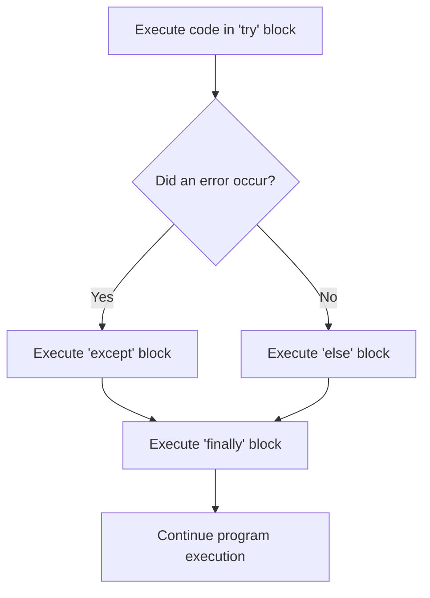
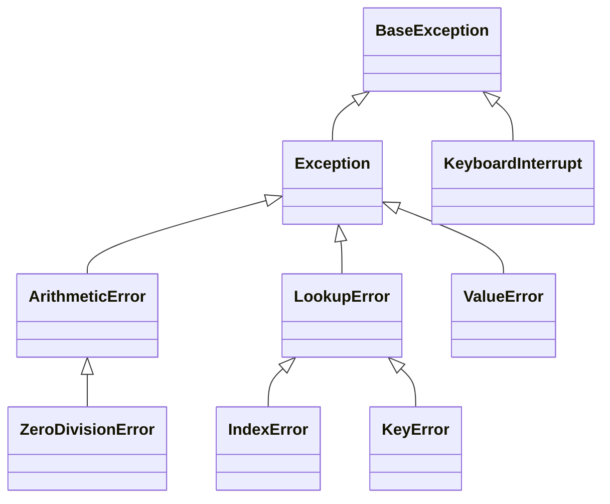
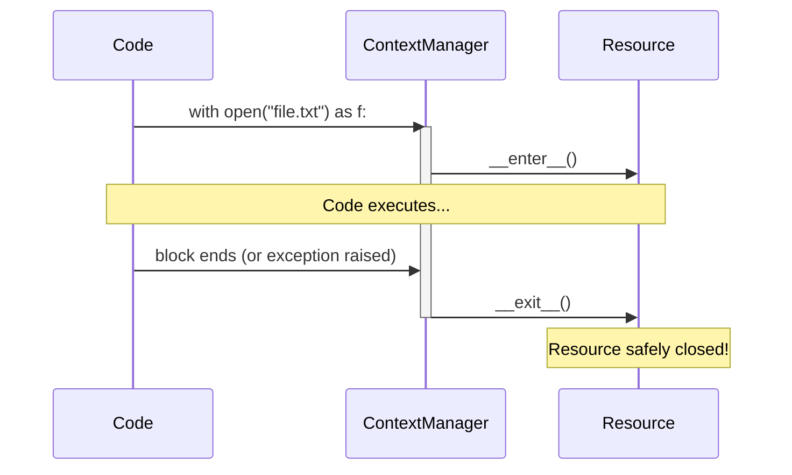

# Module 09: Exception Handling

Exceptions are Python's way of dealing with errors that happen while a program is running (runtime errors). Instead of crashing immediately, Python gives you a chance to "catch" the error and recover.

## The `try` Block Lifecycle

- **`try`**: Code that might fail.
- **`except`**: Code that runs *only* if an exception occurs.
- **`else`**: Code that runs *only* if NO exception occurred.
- **`finally`**: Code that ALWAYS runs, regardless of what happened (used for cleanup).

## Exception Hierarchy
In Python, all exceptions inherit from `BaseException`. You should generally catch specific exceptions rather than a generic one.

## The "Net Width" Comparison
Why shouldn't you just use a bare `except:` to catch everything?

| Syntax | What it catches | Good Idea? | Reason |
| --- | --- | --- | --- |
| `except FileNotFoundError:` | Only missing files | **YES** | You know exactly what went wrong and how to fix it. |
| `except Exception as e:` | Almost all errors | **OKAY** | Good as a final fallback, lets you log the error `e`. |
| `except:` | ABSOLUTELY EVERYTHING | **NO!** | Catches `SystemExit` and `KeyboardInterrupt` (Ctrl+C). You literally can't stop the program. |

## The `with` Statement (Context Managers)
When working with external resources (files, network connections), you must remember to close them, even if an error occurs. The `with` statement handles this automatically.

