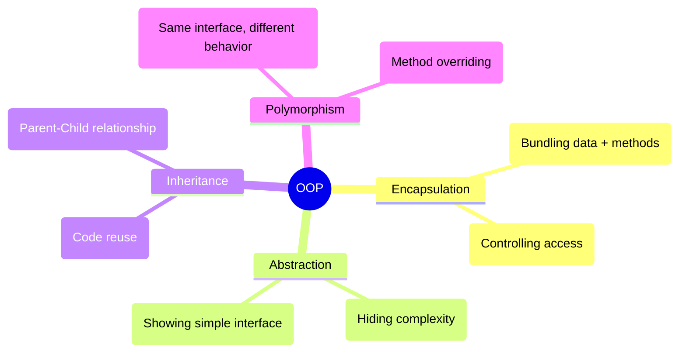
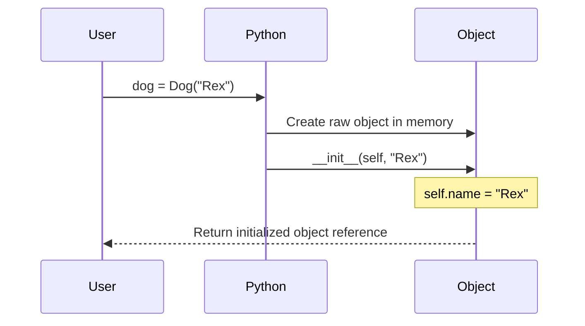
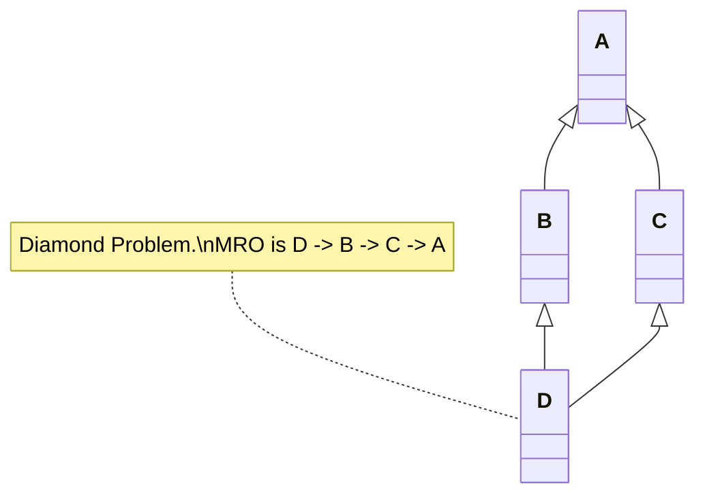
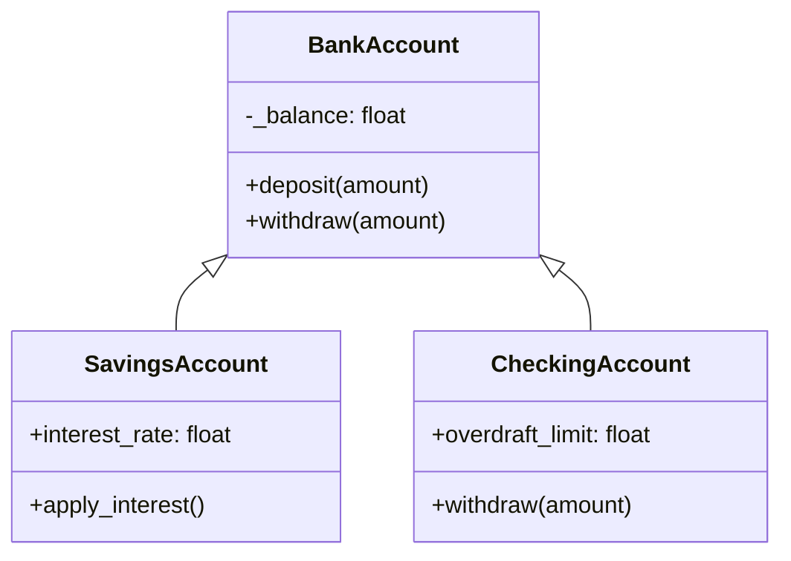

# Module 10: Object-Oriented Programming (OOP)

OOP is a paradigm for organizing code by grouping related data and behavior into "Objects".

## Why OOP? The NVT Technique
To design an OOP system from a problem statement, use the **Noun-Verb Technique (NVT)**:
1. **Nouns** become Classes (e.g., Customer, Cart)
2. **Adjectives/Properties** become Attributes (e.g., name, price)
3. **Verbs** become Methods (e.g., register(), add_item())

## The 4 Pillars of OOP

## The `__init__` Process
When you create an object (`dog = Dog()`), Python automatically calls the `__init__` constructor method to initialize it.

## Method Types

| Method Type | Decorator | First Arg | Can access instance data? | Can access class data? |
| --- | --- | --- | --- | --- |
| **Instance** | None | `self` | Yes | Yes |
| **Class** | `@classmethod` | `cls` | No | Yes |
| **Static** | `@staticmethod`| None | No | No |

## Composition vs Inheritance

| Feature | Inheritance ("is-a") | Composition ("has-a") |
| --- | --- | --- |
| **Relationship** | ElectricCar *is a* Car | Car *has an* Engine |
| **Coupling** | Very tight (child breaks if parent changes) | Loose (swap engines easily) |
| **Liskov Principle**| Child must be able to completely replace parent | N/A |
| **Preference** | Use sparingly | Prefer over inheritance |

## Multiple Inheritance and MRO
Python supports inheriting from multiple classes. If multiple parents have the same method, Python uses the Method Resolution Order (MRO) to decide which one to call.

## Real-World Example: Bank System

