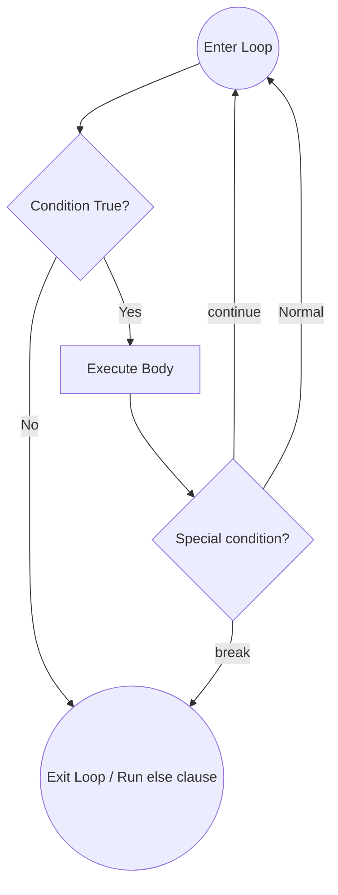

# 01 - Basics, Conditionals, and Loops

## Core Concepts

Mastering Python's foundational syntax is the bedrock of all algorithm design. Before you can solve LeetCode problems, you must have these mechanics automatic.

---

## 1. I/O and Type Casting

Python reads **everything from `input()` as a string**. You must explicitly cast to numbers.

```python
x = int(input())           # Read a single integer
y = float(input())         # Read a float
x, y, z = map(int, input().split())  # Read 3 integers on one line: "1 2 3"
```

> [!IMPORTANT]
> `map(int, input().split())` is the single most common pattern in competitive programming input.
> - `input().split()` → splits the string `"1 2 3"` by whitespace → `["1", "2", "3"]`
> - `map(int, ...)` → applies `int()` to every element → an iterator of `[1, 2, 3]`
> - Unpack into variables: `x, y, z = map(int, input().split())`

---

## 2. print() Formatting — `sep=` and `end=`

`print()` has two critical keyword arguments that affect output:
- **`sep=`**: What to print **between** arguments (default: a space `" "`)
- **`end=`**: What to print **at the end** (default: newline `"\n"`)

```python
print("hello", 50, 2.71, sep="*", end=".")   # Output: hello*50*2.71.
print(i, end=" ")   # Print without newline — used in all pattern printing
print()             # Print an empty newline to move to the next row
```

---

## 3. Operator Precedence

Python follows **PEMDAS** (Parentheses, Exponents, Multiplication/Division, Addition/Subtraction).

> [!WARNING]
> Python's `**` (exponentiation) is **right-associative**. This is a classic interview gotcha:
> ```python
> 2 ** 3 ** 2   # Evaluates as 2 ** (3**2) = 2**9 = 512  ← NOT (2**3)**2 = 64
> ```

| Expression | Result | Why |
|---|---|---|
| `3 + 5 * 4` | `23` | `*` before `+` |
| `(3 + 5) * 4` | `32` | Parens first |
| `9 - 8 / 2` | `5.0` | `/` before `-`, result is float |
| `100 / 10 * 10` | `100.0` | Left-to-right (same precedence) |
| `2 ** 3 ** 2` | `512` | Right-associative exponent |

---

## 4. Variable Packing / Unpacking & Multiple Assignment

```python
# Multiple assignment (packing)
x, y = 5, 2           # x = 5, y = 2

# The Pythonic swap — no temp variable needed
x, y = y, x           # Python evaluates the RHS fully before assigning

# Unpack from map
x, y, z = map(int, input().split())
```

> [!TIP]
> The swap `a, b = b, a` works because Python **packs the right-hand side into a temporary tuple** first, then unpacks it to the left-hand side. This is a fundamental Python implementation detail.

---

## 5. Conditional Logic (if / elif / else)

Python uses **indentation** (not curly braces) to define blocks. Logical operators are English words: `and`, `or`, `not`.

```python
# Largest of 3 — the canonical first conditional problem
if x > y and x > z:
    print(x)
elif y > x and y > z:
    print(y)
else:
    print(z)

# Edge case: ties. The above fails on x == y > z.
# Robust fix: print(max(x, y, z))
```

> [!WARNING]
> `x > y and x > z` does **not** handle ties. If `x == y == 5` and `z == 3`, neither `if` nor `elif` is True, so Python falls through to `else` and prints `z=3` — which is **wrong**. Always consider the tie edge case.

---

## 6. Loops

### `while` loops
Execute as long as a condition is true. Essential for digit extraction, pointer manipulation, and unknown termination conditions.

### `for` loops with `range()`
- `range(stop)`: `0` to `stop - 1`
- `range(start, stop)`: `start` to `stop - 1`
- `range(start, stop, step)`: increments by `step`. Use `step=2` for even numbers, `step=-1` for reverse.

### Sentinel Loop (`while True:` + `break`)
Used when the termination condition is **inside** the loop body, not known upfront:

```python
# Count positive numbers until user enters a negative
cnt = 0
while True:
    num = int(input())
    if num < 0:
        break          # Exit the loop the moment we see the sentinel value
    cnt += 1
```

---

## Control Flow Diagram: Loop Decision Tree



---

## 7. FizzBuzz — Naive vs. Correct Ordering

FizzBuzz exposes a **critical bug** that trips up beginners: **condition ordering**.

```
Buggy approach (wrong order):
    if n % 3 == 0 → prints "Fizz" for 15 ✗
    elif n % 5 == 0 → prints "Buzz" for 15 ✗
    Never reaches "FizzBuzz"!

Correct approach:
    Check the MOST SPECIFIC condition first (divisible by BOTH 3 AND 5).
```

---

## 8. Big-O Complexity Cheat Sheet

> [!IMPORTANT]
> Big-O measures **how your algorithm scales** as input size `n` grows. It ignores constants.

| Big-O | Name | Example | n=1,000 |
|---|---|---|---|
| $O(1)$ | Constant | Array lookup, formula | 1 op |
| $O(\log n)$ | Logarithmic | Binary search, halving while loop | ~10 ops |
| $O(n)$ | Linear | Single loop | 1,000 ops |
| $O(n \log n)$ | Linearithmic | Python's `sort()`, merge sort | ~10,000 ops |
| $O(n^2)$ | Quadratic | Nested loops | 1,000,000 ops |
| $O(2^n)$ | Exponential | All subsets (brute-force) | 10^301 ops |

**The "double the input" mental model:**
- If you double `n` and the runtime doubles → $O(n)$
- If it quadruples → $O(n^2)$
- If it barely changes → $O(\log n)$

**Quick rules for counting:**
1. Single loop over `n` → $O(n)$
2. Nested loops → $O(n^2)$
3. Loop that halves the search space each time → $O(\log n)$
4. Constants and lower-order terms drop → $O(3n + 5) = O(n)$
5. Consecutive (non-nested) loops **add** → $O(n) + O(n) = O(n)$
6. Nested loops **multiply** → $O(n) \times O(n) = O(n^2)$

---

## Cheat Sheet: Loop Control Keywords

> [!TIP]
> - **`break`**: Exit the loop entirely, immediately.
> - **`continue`**: Skip the rest of this iteration, jump to the next one.
> - **`for-else` / `while-else`**: The `else` block runs ONLY if the loop exits **naturally** (no `break`). Perfect for search problems.
> - **Reverse iteration**: `range(n - 1, -1, -1)` iterates from `n-1` down to `0` inclusive.

> [!WARNING]
> Beware of infinite `while` loops. Always ensure the loop variable is updated inside the body. For `while True:` loops, always ensure a `break` condition is reachable.
