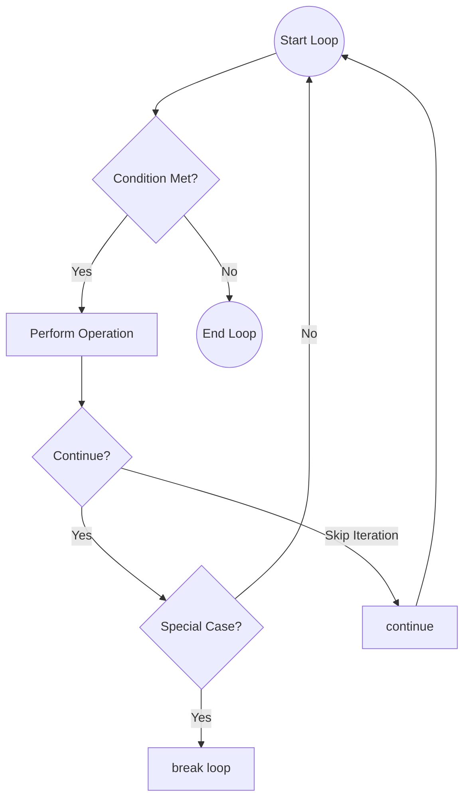

# 01 - Basics, Conditionals, and Loops

## Core Concepts

Mastering the absolute basics of Python syntax, input/output operations, logical branching, and loops is the foundation of algorithm design. 

### Basics & Operators
Python uses dynamically typed variables. Division operators are crucial for algorithmic math:
- `/` performs floating-point division (e.g., `5 / 2 = 2.5`)
- `//` performs integer (floor) division (e.g., `5 // 2 = 2`)
- `%` performs modulo (remainder) division (e.g., `5 % 2 = 1`)

### Conditional Logic
Python uses `if`, `elif`, and `else` blocks controlled by indentation, not curly braces.
Logical operators are explicit words: `and`, `or`, `not`.

### Looping Mechanisms

**1. `while` loops:**
Execute as long as a condition is true. Essential for pointer manipulation, digit extraction, and dynamic conditions.

**2. `for` loops:**
Iterate over sequences (like lists, strings, or `range()`).
- `range(stop)`: `0` to `stop - 1`.
- `range(start, stop)`: `start` to `stop - 1`.
- `range(start, stop, step)`: increments by `step` (can be negative for reverse iteration).

## Control Flow Diagram: Nested Logic

## Cheat Sheet: Loop Control

> [!TIP]
> - Need to exit a loop entirely before it naturally finishes? Use `break`.
> - Need to skip the rest of the current iteration and move to the next one? Use `continue`.
> - Need to iterate backwards? Use `range(n - 1, -1, -1)`.
> - `else` clause on a loop: Executes ONLY if the loop finishes naturally (without hitting a `break`). Very useful for prime checking or searching!

> [!WARNING]
> Beware of infinite `while` loops. Always ensure the condition being checked is updated within the loop body (e.g., incrementing a counter, dividing a number).
