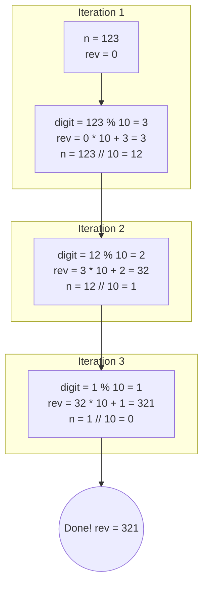

# 02 - Digits, Fibonacci, Primes, and Square Roots

## Core Concepts

Many entry-level algorithmic problems require numerical manipulation without using strings. Understanding how to strip numbers apart mathematically is a critical skill.

### Digit Extraction
You can extract digits from an integer using the modulo `%` and integer division `//` operators.
- `n % 10`: Extracts the **last digit**. (e.g., `123 % 10 = 3`)
- `n // 10`: Removes the **last digit**. (e.g., `123 // 10 = 12`)
- **Common Pattern**: Reversing a number by continuously extracting the last digit and building a new number: `rev = rev * 10 + digit`.

### Fibonacci Sequence
A sequence where the next number is the sum of the previous two numbers: $0, 1, 1, 2, 3, 5, 8 \dots$
- **Base Cases**: $F(0) = 0$, $F(1) = 1$
- **Formula**: $F(n) = F(n-1) + F(n-2)$
- **Iterative Approach**: Usually preferred over naive recursion to achieve $O(n)$ time and $O(1)$ space.

### Prime Numbers
A number greater than $1$ that has no positive divisors other than $1$ and itself.
- **Naive Check**: Check all numbers from $2$ to $n-1$. ($O(n)$)
- **Optimized Check**: Check all numbers from $2$ to $\lfloor\sqrt{n}\rfloor$. ($O(\sqrt{n})$)

### Square Roots (Integer)
Finding the integer square root ($\lfloor\sqrt{x}\rfloor$) without using `math.sqrt()` or `x ** 0.5`.
- Can be solved efficiently using **Binary Search** since $y = x^2$ is a monotonically increasing function.

## Diagram: Digit Reversal

## Cheat Sheet: Math Operations

> [!TIP]
> - "Sum of digits" or "Reverse an integer"? -> Use `while n > 0:` with `% 10` and `// 10`.
> - "Check if prime"? -> Loop up to `int(n**0.5) + 1`. If no divisors, it's prime.
> - "Find all primes up to N"? -> Look into the Sieve of Eratosthenes (advanced).
> - Handling negative numbers for digit extraction? Store the sign, take `abs(n)`, do the math, and re-apply the sign.
