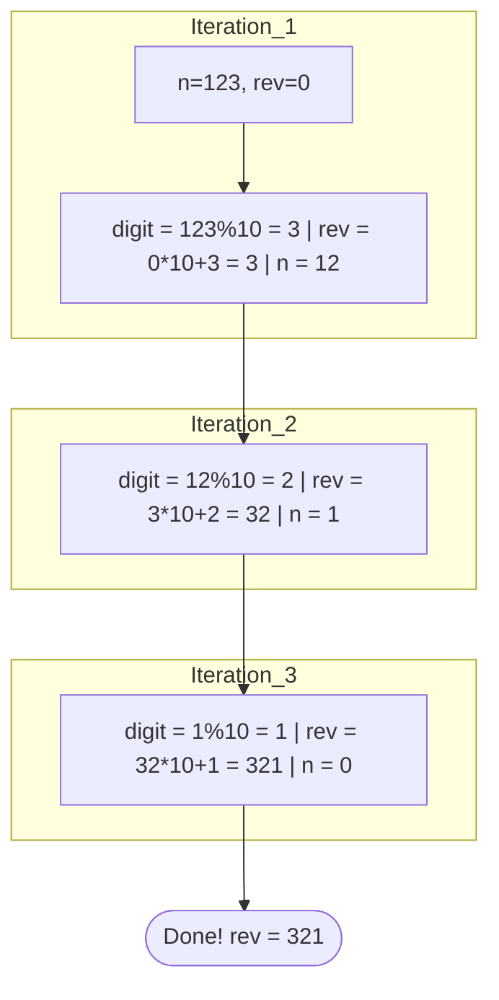
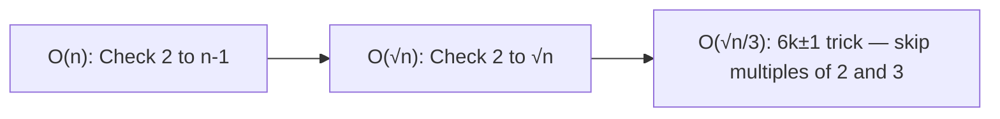

# 02 - Digits, Fibonacci, Primes, and Square Roots

## Core Concepts

Many entry-level algorithmic problems require numerical manipulation **without using strings**. Understanding how to strip numbers apart mathematically using `%` and `//` is a critical loop-design skill.

---

## 1. Digit Extraction — The `% 10` / `// 10` Pattern

You can extract digits from an integer using two operations repeatedly:
- `n % 10` → extracts the **last digit** (e.g., `1234 % 10 = 4`)
- `n // 10` → removes the **last digit** (e.g., `1234 // 10 = 123`)

The loop terminates when `n == 0` (no digits remain).

```
Peeling diagram for n = 1234:
  1234  --%10-->  4  (peeled off)     1234 // 10 = 123
   123  --%10-->  3  (peeled off)      123 // 10 =  12
    12  --%10-->  2  (peeled off)       12 // 10 =   1
     1  --%10-->  1  (peeled off)        1 // 10 =   0  ← stop
```

> [!IMPORTANT]
> **Time Complexity of digit operations**: A number `n` has `⌊log₁₀(n)⌋ + 1` digits, so these loops run in **O(log n)** time — not O(n). Each iteration chops off one digit, and numbers shrink exponentially.

> [!WARNING]
> **Never name a variable `sum`** — it shadows Python's built-in `sum()` function. Use `total` or `digit_sum` instead. If you do `sum = 0` and later call `sum(map(int, ...))`, it will throw `TypeError: 'int' object is not callable`.

**Three approaches to sum digits:**
1. **Math loop** (`% 10` / `// 10`) — works on integers, $O(\log n)$ time, $O(1)$ space
2. **String iteration** — convert to string, iterate characters — $O(\log n)$ time, $O(\log n)$ space
3. **One-liner** using `map(int, str(n))` + `sum()` — most Pythonic

---

## 2. Reversing an Integer



**Two approaches:**
1. **Mathematical** (`rev = rev * 10 + digit`) — $O(\log n)$ time, $O(1)$ space — works on actual integers
2. **String slicing** (`num[::-1]`) — $O(\log n)$ time, $O(\log n)$ space — creates a new string object

---

## 3. Fibonacci Sequence

The sequence: $0, 1, 1, 2, 3, 5, 8, 13, 21, 34, 55 \ldots$

$$F(0) = 0, \quad F(1) = 1, \quad F(n) = F(n-1) + F(n-2)$$

**Three implementations — evolution from naive to optimal:**

| Approach | Time | Space | Notes |
|---|---|---|---|
| Recursive (naive) | $O(2^n)$ | $O(n)$ call stack | Recomputes same values exponentially |
| Iterative with `c` variable | $O(n)$ | $O(1)$ | Explicit and readable |
| Iterative with tuple swap | $O(n)$ | $O(1)$ | Most Pythonic; `a, b = b, a+b` |

**The `a, b = b, a+b` trick:** Python evaluates the entire **right-hand side** before assigning. This means `b` uses the *old* value of `a`, eliminating the need for a temporary variable `c`.

---

## 4. Check if a Number IS a Fibonacci Number

Generate the sequence on the fly and compare:
- If `c == n` → True (hit it exactly)
- If `c > n` → False (overshot, it's not in the sequence)

Uses a `while True + break` sentinel pattern. Time: $O(\log n)$ (Fibonacci numbers grow exponentially, ~$\phi^k$ where $\phi \approx 1.618$, so we reach `n` in about $\log_\phi(n)$ steps).

---

## 5. Prime Numbers — Three Levels of Optimization



**Why only check up to √n?**
If `n = a × b`, one of `a` or `b` must be ≤ √n. So every factor pair has at least one member ≤ √n. Checking beyond √n only re-finds pairs you've already seen from the other side.

**Factor pairs of 36 (√36 = 6):**
```
(1, 36)  (2, 18)  (3, 12)  (4, 9)  (6, 6)
          ↑ all small factors are ≤ 6
```

> [!IMPORTANT]
> **Use `i * i <= n` not `i <= n ** 0.5`**
>
> Floating-point arithmetic has precision loss. `n ** 0.5` computes a float which may be slightly off due to binary representation limits (Pigeonhole Principle applied to infinite reals in finite memory). `i * i <= n` is pure integer arithmetic — no precision issues, no rounding errors. **Always prefer it in DSA.**

**Three `while`-loop structural approaches for prime checking:**
1. **`while-else`** — Python-specific: `else` runs only if loop exits *without* a `break`
2. **Flag variable** — portable to any language; explicit boolean tracking
3. **Check loop variable after loop** — `if i * i > n: print("prime")`

---

## 6. Square Root — Three Levels of Precision

**Level 1 — Integer part** (linear scan, $O(\sqrt{n})$):
Count up from 0 until `ans * ans > n`, then subtract 1.

**Level 2 — Decimal precision** (iterative refinement):
After finding the integer part, repeat with decreasing increment sizes:
- `+0.1` to find the tenths digit
- `+0.01` for hundredths
- `+0.001` for thousandths

**Level 3 — Generalized to `p` places** (using `inc_fac`):
Use a loop over `p` and divide `inc_fac` by 10 each round.

**Level 4 — Binary Search** ($O(\log n)$):
Since $f(x) = x^2$ is monotonically increasing, binary search the answer space `[0, x//2]`. Much faster for large `n` and exact integers.

> [!TIP]
> The linear scan approach teaches the core insight. The binary search version is what you'd use in a real interview. Both are covered in the code file below.

---

## Cheat Sheet: Math Loop Patterns

> [!TIP]
> | Problem | Pattern | Loop Condition |
> |---|---|---|
> | Sum/reverse digits | `digit = n % 10; n //= 10` | `while n != 0` |
> | Integer square root | `while ans * ans <= n: ans += 1` | then `ans - 1` |
> | Prime check | `while i * i <= n:` | prefer `i*i` over `i <= n**0.5` |
> | Check Fibonacci | `c = a+b; if c==n; elif c>n` | `while True + break` |
