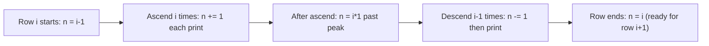

# 03 - Pattern Printing and Pattern Problems

## Core Concepts

Pattern printing is the ultimate test of **nested loop mechanics**. The structural thinking required translates directly to matrix traversal, image manipulation, and 2D grid algorithms in interviews.

---

## 1. The Anatomy of Every Pattern

Every pattern is a 2D grid:
- **Outer loop (`i`)**: Controls which **row** you are on
- **Inner loop(s) (`j`, `k`, `l`)**: Control what is **printed in that row**

### The 5-Step Pattern-Solving Strategy

1. **Observe**: Draw the expected output. Count rows.
2. **Identify structure**: Triangle? Pyramid? Diamond? Two-halves?
3. **Break each row into parts**: spaces | stars/numbers | mirrored numbers
4. **Find the formula**: relate row number `i` to count of spaces and symbols
5. **Code**: outer loop for rows → inner loop(s) per part

### The Critical Design Decision: Reset vs. Carry Forward

> [!IMPORTANT]
> This is the most misunderstood concept in pattern printing.
>
> **Pattern 1 (Number Triangle)**: The print variable resets to 1 at the start of every row.
> ```
> 1        ← starts at 1
> 1 2      ← resets and starts at 1 again
> 1 2 3    ← resets again
> ```
>
> **Pattern 2 (Continuous Number Triangle)**: The print variable is initialized ONCE and carries forward across rows.
> ```
> 1        ← starts at 1
> 2 3      ← continues from where row 1 left off
> 4 5 6    ← continues from where row 2 left off
> ```
>
> The only code change: move `num = 1` **outside** the outer loop.

---

## 2. String Multiplication vs Inner Loops — Big-O Abstraction

> [!IMPORTANT]
> **`"* " * n`** in Python is an $O(n)$ string creation operation. It allocates a new string of length `2n`.
>
> **An inner `for` loop** that prints `n` characters is also $O(n)$ — but at the I/O level.
>
> Both are $O(n^2)$ total across all `n` rows. The difference is:
> - **String multiplication** is a single Python operation — no Python loop overhead per character, faster in practice
> - **Inner for loops** are portable to all languages (Java, C++, etc.) and allow printing **different values** per position (numbers, alternating characters)
>
> You cannot use `"* " * n` when the content changes per position (e.g., alternating 0/1, or incrementing numbers). You must use explicit inner loops then.

---

## 3. Pattern Reference Table

For `n` rows (1-indexed `i` from 1 to n):

| Pattern | Spaces per row | Content per row | Inner loops |
|---|---|---|---|
| Square | 0 | `n` symbols | 1 |
| ▲ Right triangle (incr.) | 0 | `i` symbols | 1 |
| ▽ Right triangle (decr.) | 0 | `n-i+1` symbols | 1 |
| ▷ Right-aligned triangle | `n-i` spaces | `i` symbols | 2 |
| ◁ Right-aligned inverted | `i-1` spaces | `n-i+1` symbols | 2 |
| △ Pyramid | `n-i` spaces | `2i-1` stars | 2 |
| ▽ Inverted pyramid | `i-1` spaces | `2(n-i+1)-1` stars | 2 |
| ◇ Butterfly (upper) | — | `i` + `2(n-i)` gap + `i` | 3 |
| ◆ Butterfly (lower) | — | `(n-i+1)` + `2(i-1)` gap + `(n-i+1)` | 3 |
| 🔢 Continuous triangle | 0 | `i` values (carry fwd) | 1 + global counter |
| 🔀 Binary triangle | 0 | `i` values (0/1 toggle) | 1 + row-parity seed |
| 🔢 Right-aligned number | `n-i` spaces | `i` values starting from `i` | 2 |
| ⛰ Number mountain | `n-i` spaces | ascend `i` + descend `i-1` | 3 sequential loops |
| 💎 Star diamond | 0 | conditional: `i` or `n-i+1` | 1 (string multiply) |

---

## 4. Complexity Analysis

> [!NOTE]
> **All triangle/pyramid patterns are $O(n^2)$ time, $O(1)$ space.**
>
> Total characters printed: $1 + 2 + 3 + \ldots + n = \dfrac{n(n+1)}{2} = O(n^2)$
>
> You **cannot** do better — you must print $O(n^2)$ characters, so any algorithm is at best $O(n^2)$.
>
> The interesting optimization question isn't "can we beat $O(n^2)$?" but rather:
> - Are we doing **unnecessary extra work** per element?
> - Are we **recomputing** values we could derive from the previous iteration?

| Pattern | Time | Space | Notes |
|---|---|---|---|
| All triangle/pyramid patterns | $O(n^2)$ | $O(1)$ | Must print n(n+1)/2 items |
| Butterfly | $O(n^2)$ | $O(1)$ | Total items still O(n) per row × n rows |
| Star Diamond (string multiply) | $O(n^2)$ | $O(n)$ | String `"* " * k` is O(k) in memory per row |
| Star Diamond (inner loop) | $O(n^2)$ | $O(1)$ | No temporary string allocation |

> [!TIP]
> **String multiply space note**: `"* " * n` creates a temporary string of length $O(n)$ in memory, which is immediately freed after printing. Technically $O(n)$ transient space per row. Inner loops are strictly $O(1)$ space.

---

## 5. The Toggle Idiom

For Binary Triangle and similar alternating patterns, the cleanest flip idiom is:

```python
num = 1 - num   # flips: 1 → 0, and 0 → 1
                # 1 - 1 = 0,  1 - 0 = 1
```

This is cleaner than `if/else` and is a standard competitive programming pattern.

**Seeding the row start value** based on row parity:
```python
num = 0 if i % 2 == 0 else 1   # even rows start with 0, odd rows start with 1
```

---

## 6. Number Mountain — State Tracking

The Number Mountain is the hardest pattern because a **single counter `n` carries state across all three parts of every row**:

```
After ascending part: n is 1 PAST the peak (because the loop increments then exits)
Descending: n -= 1 BEFORE printing (first decrement brings n back to peak - 1)
```

**Net change per row** = (ascending adds `i`) − (descending subtracts `i-1`) = **+1**

So the counter naturally starts each row at the correct value — it self-corrects.


