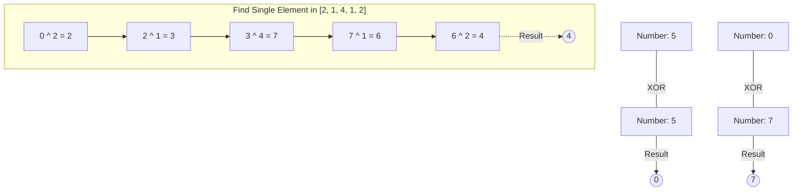

# 04 - Bitwise Operations and Logic Gates

## Core Concepts

Bitwise operations evaluate data at the binary level (0s and 1s). Since modern CPUs execute these instructions natively, they are incredibly fast. Many algorithms use bit manipulation for $O(1)$ space flags or mathematical shortcuts.

### Binary Representation
In Python, you can write binary numbers using the `0b` prefix (e.g., `0b101` is $5$). 
You can view the binary representation of an integer using `bin(n)`.

### Logic Gates (Bitwise Operators)
- **AND (`&`)**: Returns 1 if *both* bits are 1. Useful for masking/checking bits.
  - `101 & 011 = 001`
- **OR (`|`)**: Returns 1 if *either* bit is 1. Useful for setting bits.
  - `101 | 011 = 111`
- **XOR (`^`)**: Returns 1 if the bits are *different*. Useful for toggling bits and finding missing numbers.
  - `101 ^ 011 = 110`
  - *Key Property*: `A ^ A = 0` and `A ^ 0 = A`.
- **NOT (`~`)**: Inverts all bits. Due to two's complement in Python, `~n = -(n + 1)`.

### Bit Shifting
- **Left Shift (`<<`)**: Shifts bits to the left, padding with 0s. 
  - `n << 1` is equivalent to multiplying by 2.
- **Right Shift (`>>`)**: Shifts bits to the right, discarding the rightmost bits.
  - `n >> 1` is equivalent to integer dividing by 2 (floor division).

## Diagram: XOR Canceling

## Cheat Sheet: Bitwise Tricks

> [!TIP]
> - Is a number Even or Odd? -> `n & 1 == 1` means Odd. `n & 1 == 0` means Even. (Faster than `n % 2`).
> - Multiply/Divide by 2? -> Use `n << 1` for multiply, `n >> 1` for divide.
> - Swap two variables without a temp variable? -> `a = a ^ b; b = a ^ b; a = a ^ b`. (In Python, just use `a, b = b, a`).
> - Find the only non-repeated number in an array where every other number repeats twice? -> XOR all elements together. The duplicates cancel out to 0.

> [!WARNING]
> Python handles integers with arbitrary precision, meaning they don't natively overflow into negatives like 32-bit integers in Java/C++. When doing bitwise operations requiring fixed 32-bit width constraints (like LeetCode's "Reverse Bits"), you often need to manually mask it with `& 0xFFFFFFFF`.
