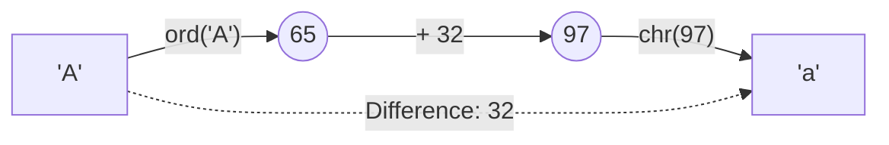

# 05 - Characters and ASCII Manipulation

## Core Concepts

Characters in Python are just strings of length 1. Under the hood, computers store characters as numbers using encodings like ASCII (or Unicode). Understanding this relationship allows you to perform "math" on characters.

### ASCII Values
- `'A'` to `'Z'`: $65$ to $90$
- `'a'` to `'z'`: $97$ to $122$
- `'0'` to `'9'`: $48$ to $57$

### Python Functions
- `ord(char)`: Returns the integer ASCII value of a character.
  - `ord('A')` -> $65$
- `chr(num)`: Returns the character corresponding to the integer ASCII value.
  - `chr(65)` -> `'A'`

### Character Math
Because lowercase and uppercase letters are separated by exactly $32$ (`97 - 65 = 32`), you can convert between them mathematically:
- `lowercase_ascii = uppercase_ascii + 32`
- `uppercase_ascii = lowercase_ascii - 32`

Similarly, you can map characters to a 0-indexed alphabet array (useful for Hash Maps / frequency counting):
- `index = ord(char) - ord('a')` maps `'a'` -> $0$, `'b'` -> $1$, ..., `'z'` -> $25$.

## Diagram: ASCII Math

## Cheat Sheet: Character Tricks

> [!TIP]
> - Converting a string digit to an integer without `int()`? -> `digit_val = ord(char) - ord('0')`
> - Building a frequency map for lowercase english letters? -> Create an array of size 26: `counts = [0]*26`. Update counts with `counts[ord(char) - ord('a')] += 1`.
> - Strings in Python are **immutable**. You cannot do `s[0] = 'a'`. You must convert the string to a list first: `l = list(s)`, mutate it, and then join it: `"".join(l)`.

> [!WARNING]
> Python's `str.islower()` and `str.isupper()` are helpful, but in strict interviews, they might ask you to implement them yourself using `ord()` boundaries. e.g., `if ord('a') <= ord(c) <= ord('z'):`.
