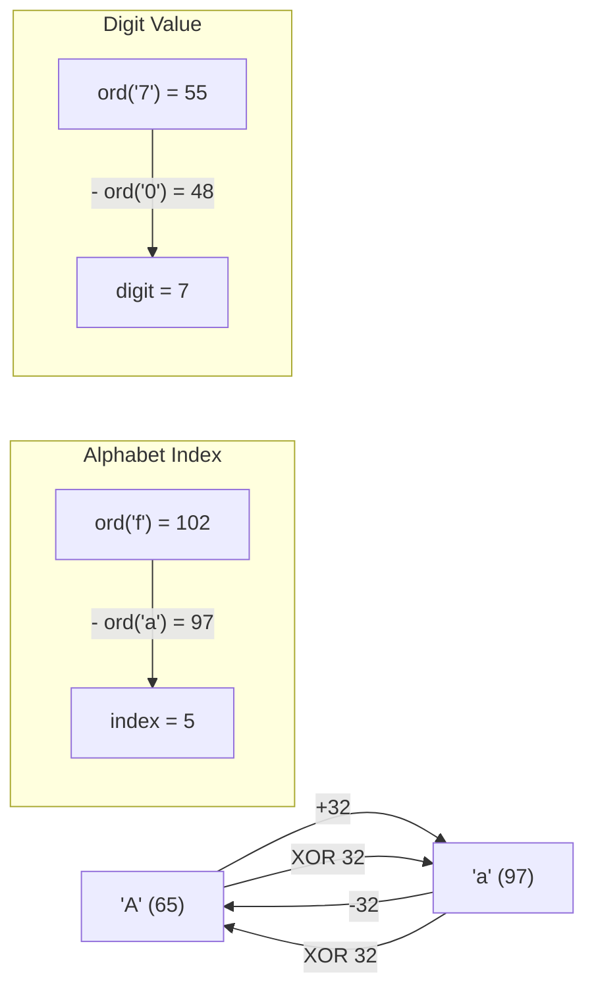

# 05 - Characters and ASCII Manipulation

## 1. Python's Character Type

> [!IMPORTANT]
> Python has **no separate `char` type**. A character is simply a `str` of length 1.
>
> | Language | Character type | Example |
> |---|---|---|
> | C / Java | Distinct `char` type | `char c = 'A';` |
> | Python | `str` of length 1 | `c = "A"` (still `type(c) == str`) |
>
> This means all string operations work on single characters too:
> `len("A") == 1`, `"A" < "B"` (lexicographic, based on ASCII), `"A" + "B" == "AB"`.

---

## 2. ASCII — The Number Behind Every Character

Every character is stored as an integer. ASCII (American Standard Code for Information Interchange) defines the mapping.

### Two essential functions

| Function | Direction | Example |
|---|---|---|
| `ord(char)` | character → integer | `ord('A')` → `65` |
| `chr(num)` | integer → character | `chr(65)` → `'A'` |

**Mental model:** `ord` and `chr` are exact inverses — a two-way lookup on a number line:

```
... 47   48   49  ...  57   58  ...  64   65   66  ...  90   91  ...  96   97   98  ... 122  123
     /    0    1        9    :        @    A    B        Z    [        `    a    b        z    {
          ^─── digits ─^               ^─── uppercase ─^               ^─── lowercase ──^
```

`ord(char)` walks left → right (char to number).  
`chr(num)` walks right → left (number to char).  
They are exact inverses: `chr(ord(c)) == c` and `ord(chr(n)) == n`.

### ASCII Reference Table (memorize these ranges)

| Characters | Range | Count | Key formula |
|---|---|---|---|
| `'0'` to `'9'` | 48 – 57 | 10 | `ord(ch) - 48` → digit value |
| `'A'` to `'Z'` | 65 – 90 | 26 | `ord(ch) - 65` → 0-indexed position |
| `'a'` to `'z'` | 97 – 122 | 26 | `ord(ch) - 97` → 0-indexed position |

**Critical relationship:** `ord('a') - ord('A') = 97 - 65 = 32`

This single fact powers **all case conversion** without any built-in methods.

---

## 3. Character Arithmetic

Because characters map to integers, you can do "math" on them:

```
'a'  ─ord()→  97  ─(+1)→  98  ─chr()→  'b'
```

**You cannot add an int directly to a str** — `'a' + 1` is a `TypeError`. You always round-trip: `ord()` out, do math, `chr()` back in.

### Case Conversion Techniques (no built-ins)

| Technique | Expression | Notes |
|---|---|---|
| Uppercase → lowercase | `chr(ord(ch) + 32)` | Add 32 |
| Lowercase → uppercase | `chr(ord(ch) - 32)` | Subtract 32 |
| Toggle case (bitwise) | `chr(ord(ch) ^ 32)` | XOR with 32 |

**Why XOR 32 works:**

`32 = 0b00100000`. Bit 5 is the only bit set. XOR flips bit 5 only:
```
'A' = 01000001   XOR
 32 = 00100000
    = 01100001 = 97 = 'a'   ← uppercase became lowercase

'a' = 01100001   XOR
 32 = 00100000
    = 01000001 = 65 = 'A'   ← lowercase became uppercase
```

Bit 5 is the **exact bit that separates uppercase from lowercase** in ASCII. XOR 32 is an O(1) branchless toggle — faster than an `if/else` in performance-critical code.

### Alphabet Index (0-indexed)

```python
ord(ch) - ord('A')   # 'A'→0, 'B'→1, ..., 'Z'→25
ord(ch) - ord('a')   # 'a'→0, 'b'→1, ..., 'z'→25
ord(ch) - ord('0')   # '0'→0, '1'→1, ..., '9'→9  (digit value without int())
```

---

## 4. Diagram: Full ASCII Math Flow



---

## 5. Fixed-Size Frequency Array vs Dictionary

This is a **top-tier interview optimization** for string frequency problems.

### ❌ Naive: Hash Map / Dictionary — O(n) space, hash overhead

```python
freq = {}
for ch in s:
    freq[ch] = freq.get(ch, 0) + 1
```

### ✅ Optimal: Fixed-Size Array — O(1) space (constant 26 slots)

```python
freq = [0] * 26
for ch in s:
    freq[ord(ch) - ord('a')] += 1   # direct array index = O(1)
```

### Why it's better

| Property | Hash Map | Fixed Array |
|---|---|---|
| Space | O(k) — grows with unique chars | **O(1)** — always exactly 26 |
| Index computation | Hash function (multiple ops) | **Single subtraction** |
| Cache behaviour | Pointer chasing | **Contiguous memory — cache-friendly** |
| Interview signal | Standard | **Shows deeper CPU/memory understanding** |

**Interview rule:** whenever the input is constrained to lowercase English letters (the most common constraint), replace the dict with a `[0] * 26` array.

---

## 6. String Immutability

> [!WARNING]
> Strings in Python are **immutable**. `s[0] = 'J'` raises `TypeError`.
>
> To "modify" a string: `list(s)` → mutate → `"".join(result)`

### String Building Performance

| Method | Time | Why |
|---|---|---|
| `result += ch` in a loop | O(n²) total | Each `+=` creates a new string object |
| `list.append(ch)` then `"".join()` | **O(n)** | One allocation pass at join |
| Generator with `"".join()` | **O(n)** | Same — avoids intermediate list |

Always use `list` + `"".join()` when building strings character by character.

---

## 7. Character Type Checks (without built-ins)

Implement these from scratch for interviews:

```python
def is_uppercase(ch): return 65 <= ord(ch) <= 90    # 'A'–'Z'
def is_lowercase(ch): return 97 <= ord(ch) <= 122   # 'a'–'z'
def is_digit(ch):     return 48 <= ord(ch) <= 57    # '0'–'9'
def is_letter(ch):    return is_uppercase(ch) or is_lowercase(ch)
```

---

## 8. Caesar Cipher — The Canonical ASCII Interview Problem

**Formula:** `(ord(ch) - ord('A') + k) % 26` maps any shift into `[0..25]`, wrapping naturally.

```
'X' (shift +5):
  ord('X') - ord('A') = 23
  (23 + 5) % 26 = 2
  chr(ord('A') + 2) = 'C'   ← wrapped from X → C
```

Key properties:
- `% 26` handles both positive shift (encrypt) and negative shift (decrypt)
- Preserve original case: use separate branches for upper/lowercase
- Non-letters pass through unchanged

---

## 9. Interview Cheat Sheet

> [!TIP]
> | Task | Expression | Complexity |
> |---|---|---|
> | Char → int | `ord(ch)` | O(1) |
> | Int → char | `chr(n)` | O(1) |
> | Upper → lower | `chr(ord(ch) + 32)` | O(1) |
> | Lower → upper | `chr(ord(ch) - 32)` | O(1) |
> | Toggle case | `chr(ord(ch) ^ 32)` | O(1) |
> | Check uppercase | `65 <= ord(ch) <= 90` | O(1) |
> | Check lowercase | `97 <= ord(ch) <= 122` | O(1) |
> | Check digit | `48 <= ord(ch) <= 57` | O(1) |
> | Digit value | `ord(ch) - ord('0')` | O(1) |
> | Letter index (0-25) | `ord(ch) - ord('a')` | O(1) |
> | Frequency array | `[0] * 26` | O(1) space |
> | Caesar shift | `(ord(ch) - ord('A') + k) % 26` | O(1) per char |

> [!NOTE]
> **On Python char comparisons:** `'a' < 'b'` works via ASCII ordering — no `ord()` needed. But for boundary checks like `is_lowercase`, using `ord()` with integer ranges is cleaner and more explicit in interviews.
