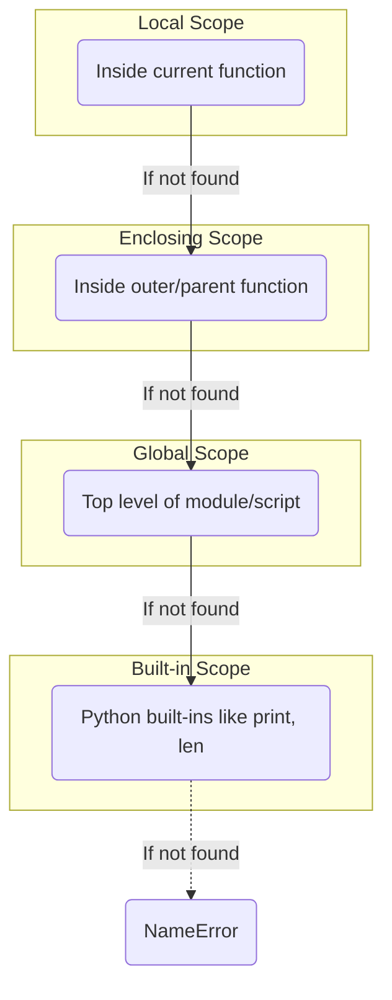

# 06 - Advanced Functions and Scope

## Core Concepts

Functions allow you to encapsulate logic, making it reusable and testable. Understanding how Python handles arguments and variable scope is critical to avoid unexpected side-effects.

### Function Arguments
- **Positional Arguments**: Assigned based on their position in the function call.
- **Keyword Arguments**: Assigned explicitly by name (e.g., `func(age=25)`).
- **Default Arguments**: Values provided in the definition (e.g., `def func(x=10):`). If not passed by the caller, the default is used.
  - *Warning*: Never use mutable objects (like `[]` or `{}`) as default arguments! They are evaluated once at definition time, meaning the same list will be shared across all function calls.
- **`*args`**: Collects arbitrary positional arguments into a Tuple.
- **`**kwargs`**: Collects arbitrary keyword arguments into a Dictionary.

### Variable Scope
Scope defines where a variable can be accessed.
1. **Local Scope**: Variables defined inside a function. They die when the function returns.
2. **Global Scope**: Variables defined at the top level of the script. 
  - To *read* a global variable inside a function, just use its name.
  - To *modify* a global variable inside a function, you must declare it using the `global` keyword first.
3. **Nonlocal Scope**: Used in nested functions to modify a variable in the parent function's scope. Extremely common in DFS / backtracking algorithms!

### Lambda Functions
Anonymous, one-line functions. Often used as the `key` parameter in sorting.
- `lambda x: x ** 2`

## Diagram: Scope Resolution (LEGB Rule)

## Cheat Sheet: Scope Tricks

> [!TIP]
> - Doing recursive DFS inside a main function? Define a helper function inside the main function, and use `nonlocal count` if you need to update a counter defined in the main function.
> - Need to sort a list of tuples by the *second* element? -> `arr.sort(key=lambda x: x[1])`.
> - Always type hint your functions in interviews (e.g., `def solve(nums: List[int]) -> int:`). It shows production-level maturity.
