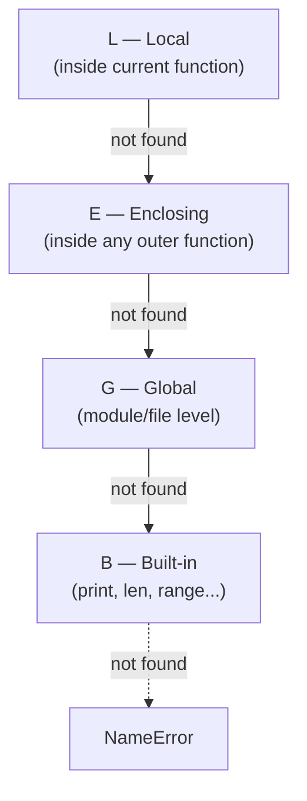

# 06 - Advanced Functions and Scope

## 1. Why Functions Exist

Functions solve five interconnected problems:

| Benefit | Explanation |
|---|---|
| **Modularity** | Break large problems into small, testable pieces |
| **Reusability** | Write once, call many times |
| **Readability** | Meaningful names make code self-documenting |
| **Testability** | Test each function independently |
| **DRY** | Don't Repeat Yourself — one place to change |

---

## 2. Parameters vs Arguments

> [!IMPORTANT]
> These two words are often used interchangeably but mean different things:
>
> - **Parameter** — the variable name in the function **definition** (placeholder)
> - **Argument** — the actual value you **pass** when calling the function
>
> ```python
> def multiply(x, y):          # x, y are PARAMETERS
>     return x * y
>
> multiply(4, 7)                # 4, 7 are ARGUMENTS
> ```
>
> **Memory walkthrough of a call:**
> 1. Python evaluates `4` and `7`
> 2. Creates a new local stack frame: `x=4`, `y=7`
> 3. Executes `x * y = 28`
> 4. Returns `28` — the frame is destroyed

---

## 3. `return` vs `print` — The Most Common Beginner Confusion

| | `print(value)` | `return value` |
|---|---|---|
| Shows on screen? | ✅ Yes | ❌ No |
| Caller can use the value? | ❌ No (returns `None`) | ✅ Yes |
| Use case | Debugging, display | Computation, piping data |

```python
def add_print(a, b): print(a + b)   # side effect, returns None
def add_return(a, b): return a + b  # silent, value usable

r1 = add_print(7, 8)    # prints 15, but r1 = None
r2 = add_return(7, 8)   # silent,     but r2 = 15
print(r2 * 2)           # 30 — you can compute with returned values
```

---

## 4. Positional vs Keyword vs Default Arguments

### Argument Types

```python
def describe_pet(animal: str, name: str, age: int) -> None:
    print(f"{name} is a {age}-year-old {animal}.")

describe_pet("dog", "Buddy", 5)             # positional — ORDER matters
describe_pet(age=3, name="Whiskers", animal="cat")  # keyword — ORDER doesn't matter
describe_pet("parrot", name="Polly", age=2) # mix: positional first, keyword second
```

> [!CAUTION]
> **SyntaxError**: positional arguments must always come **before** keyword arguments.
> `describe_pet(animal="dog", "Rex", 4)` → `SyntaxError`

### Default Arguments

```python
def power(base: int, exponent: int = 2) -> int:
    return base ** exponent

power(5)     # 25  — uses default exponent=2
power(5, 3)  # 125 — overrides default
```

**Rule:** parameters with defaults must come **after** those without.

---

## 5. The Mutable Default Argument Trap 🪤

> [!CAUTION]
> **This is one of the most common Python bugs.** Default argument values are evaluated
> **ONCE at function definition time**, not each time the function is called.
> The same mutable object is reused on every call.
>
> ```python
> def append_bad(item, lst=[]):   # ❌ lst=[] created ONCE, shared forever
>     lst.append(item)
>     return lst
>
> append_bad(1)   # [1]        — looks fine
> append_bad(2)   # [1, 2]     — where did 1 come from?!
> append_bad(3)   # [1, 2, 3]  — list persists across calls!
> ```
>
> **Fix: use `None` as a sentinel** — create a fresh object inside the function body:
> ```python
> def append_good(item, lst=None):   # ✅ None is immutable — safe sentinel
>     if lst is None:
>         lst = []                   # brand-new list for this call
>     lst.append(item)
>     return lst
> ```
> **Applies to**: `list`, `dict`, `set` — any mutable default. `int`, `str`, `tuple` are safe.

---

## 6. `*args` and `**kwargs` — Packing & Unpacking

### Mental Model: Collecting Buckets

```
call: total(1, 2, 3)
             ↓  ↓  ↓
*args bucket → (1, 2, 3)          ← a TUPLE (positional leftovers)

call: info(name="Alice", age=25)
            ↓              ↓
**kwargs bucket → {"name": "Alice", "age": 25}   ← a DICT (keyword leftovers)
```

### Packing (collecting into the function)

```python
def total(*args) -> int:          # args is a tuple
    return sum(args)

def info(**kwargs) -> None:       # kwargs is a dict
    for k, v in kwargs.items():
        print(f"{k}: {v}")

total(1, 2, 3)                    # args = (1, 2, 3)
info(name="Alice", age=25)        # kwargs = {"name": "Alice", "age": 25}
```

### Unpacking (spreading out to a function)

```python
def add_three(a, b, c): return a + b + c

numbers = [10, 20, 30]
add_three(*numbers)          # same as add_three(10, 20, 30)

config = {"a": 1, "b": 2, "c": 3}
add_three(**config)          # same as add_three(a=1, b=2, c=3)
```

### Combined Order

```python
def flexible(required, *args, **kwargs):
    ...
# Rule: regular params → *args → **kwargs
```

---

## 7. Variable Scope — The LEGB Rule

When Python encounters a name, it searches in this exact order:



### Code Example: All Four Levels at Once

```python
a_global = 3                    # G — Global scope

def outer():
    b_enclosing = 4             # E — Enclosing scope (visible to inner())

    def inner():
        c_local = 5             # L — Local scope
        # LEGB resolution: c_local→L, b_enclosing→E, a_global→G, print→B
        result = a_global * b_enclosing * c_local   # 3 * 4 * 5 = 60
        return result

    return inner()
```

### `global` and `nonlocal` Keywords

| Keyword | When to use | Risk |
|---|---|---|
| `global x` | Modify a module-level variable inside a function | Hard to track — use sparingly |
| `nonlocal x` | Modify an **enclosing** function's variable (nested functions, DFS counters) | Clean for closures/recursion |

> [!TIP]
> **DFS/backtracking pattern:** define a helper inside the main function, use `nonlocal count` to accumulate a counter without global state. This is the #1 use of `nonlocal` in interview problems.

---

## 8. Lambda Functions

A lambda is an anonymous, one-expression function with an implicit `return`:

```
lambda parameters: expression
```

| | `def` | `lambda` |
|---|---|---|
| Named? | ✅ Yes | ❌ No (until assigned) |
| Multi-line? | ✅ Yes | ❌ No |
| Docstring? | ✅ Yes | ❌ No |
| Use case | Reusable, complex logic | Short throwaway — `map`/`filter`/`sorted` |

```python
square = lambda x: x ** 2        # equivalent to def square(x): return x**2
square(5)                         # 25
```

---

## 9. Higher-Order Functions

A **higher-order function** takes another function as an argument, or returns one.

### The Four You Must Know

| Function | What it does | Time | Returns |
|---|---|---|---|
| `map(fn, it)` | Apply `fn` to every element | O(n) | Iterator |
| `filter(fn, it)` | Keep elements where `fn` returns `True` | O(n) | Iterator |
| `reduce(fn, it)` | Accumulate to a single value (left-to-right) | O(n) | Single value |
| `sorted(it, key=fn)` | Sort by `fn`'s return value | O(n log n) | New list |

### `reduce()` Step-by-Step

`reduce(lambda acc, x: acc * x, [1, 2, 3, 4, 5])`:

| Step | `acc` | `x` | Result |
|---|---|---|---|
| 1 | 1 | 2 | 2 |
| 2 | 2 | 3 | 6 |
| 3 | 6 | 4 | 24 |
| 4 | 24 | 5 | **120** |

---

## 10. Closures — Functions with a "Backpack"

A **closure** is an inner function that **remembers** variables from its enclosing scope even after the outer function has returned.

```python
def make_multiplier(factor: int):
    def multiplier(x):
        return x * factor       # 'factor' lives in the closure's "backpack"
    return multiplier           # return the function OBJECT (not calling it!)

double = make_multiplier(2)    # double's backpack: {factor: 2}
triple = make_multiplier(3)    # triple's backpack: {factor: 3}
double(5)   # 10 — opens its own backpack
triple(5)   # 15 — opens its own independent backpack
```

Each `make_multiplier` call creates a **separate** closure — they don't share state.

---

## 11. Matrix Multiplication

### Dimension Rule

```
mat1: (p × q)  @  mat2: (q × c)   ← inner dimensions MUST match
        \_____/
        must be equal
result: (p × c)                    ← outer dimensions become the result shape
```

### Formula

`result[i][j] = Σ(k=0..q-1) mat1[i][k] * mat2[k][j]`  (dot product of row i × column j)

### Complexity

| | Cost |
|---|---|
| **Time** | O(p × q × c) — O(n³) for square matrices |
| **Space** | O(p × c) — result matrix |

> [!NOTE]
> In production, use `numpy`: `np.array(m1) @ np.array(m2)` — implemented in C with BLAS/LAPACK, 100×+ faster. Implement from scratch only in interviews to demonstrate nested-loop mastery.

---

## 12. Interview Cheat Sheet

> [!TIP]
> | Pattern | Code |
> |---|---|
> | Mutable default fix | `def f(lst=None): lst = lst or []` |
> | Any-arg sum | `def f(*args): return sum(args)` |
> | Unpack list to args | `f(*my_list)` |
> | Unpack dict to kwargs | `f(**my_dict)` |
> | Sort by second element | `arr.sort(key=lambda x: x[1])` |
> | Sort by two keys | `arr.sort(key=lambda x: (x[1], x[0]))` |
> | Filter evens | `list(filter(lambda x: x%2==0, nums))` |
> | Square all | `list(map(lambda x: x**2, nums))` |
> | Product via reduce | `reduce(lambda a,b: a*b, nums)` |
> | Closure counter | `nonlocal count; count += 1` |
> | Type hint convention | `def solve(nums: List[int]) -> int:` |
