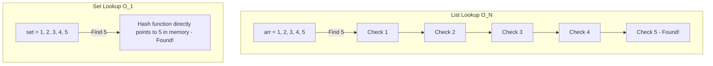

# 07 - Python Built-in Collections

## Core Concepts

Understanding the performance characteristics of Python's built-in collections is arguably the most important skill for passing a technical interview. Choosing the wrong data structure changes your algorithm from $O(n)$ to $O(n^2)$.

### Lists (Dynamic Arrays)
Lists in Python are dynamic arrays. They are continuous blocks of memory.
- **Append/Pop from end**: $O(1)$
- **Insert/Pop from beginning or middle**: $O(n)$ because all subsequent elements must be shifted.
- **Lookup by index**: $O(1)$
- **Search by value (`val in arr`)**: $O(n)$

### Tuples
Tuples are **immutable** lists. Once created, they cannot be changed.
- Because they are immutable, they can be used as **keys in Dictionaries** or elements in **Sets**. (Lists cannot).
- Often used to return multiple values from a function.

### Dictionaries (Hash Maps)
Dictionaries store Key-Value pairs. They use a hash table under the hood.

**Time Complexity Mechanics:**
- **Average Case**: $O(1)$ for Insert, Update, Lookup, and Delete. The hash function instantly computes the memory index for the key.
- **Worst Case**: $O(n)$ for all operations. This occurs during a **Hash Collision** (when multiple keys hash to the same bucket). Python handles collisions using "Open Addressing", but if the map gets too crowded or maliciously crafted keys are used, performance degrades to $O(n)$.
- As of Python 3.7+, Dictionaries also maintain insertion order.

### Sets (Hash Sets)
Sets are identical to dictionaries under the hood, but they only store Keys (no Values). They enforce absolute uniqueness.
- **Time Complexity Mechanics**: Just like dictionaries, $O(1)$ average case and $O(n)$ worst-case for Add, Remove, and Check (`val in set`).
- **Use Case**: Extremely useful for removing duplicates from a list or performing rapid $O(1)$ lookups during algorithmic problems.

## Diagram: List vs Set Lookup Time

## Cheat Sheet: Slicing Syntax

Slicing allows you to extract portions of a List, Tuple, or String.
**Syntax**: `collection[start:stop:step]`
> [!TIP]
> - `arr[0:3]` -> Gets elements at index 0, 1, 2.
> - `arr[:3]` -> Implicitly starts at 0.
> - `arr[3:]` -> Implicitly goes to the end.
> - `arr[::-1]` -> Reverses the collection.
> - `arr[:]` -> Creates a shallow copy of the entire collection.

> [!WARNING]
> While `arr.pop(0)` works, it is an $O(n)$ operation. If you need a queue where you constantly add to the end and pop from the front, use `collections.deque` instead.
