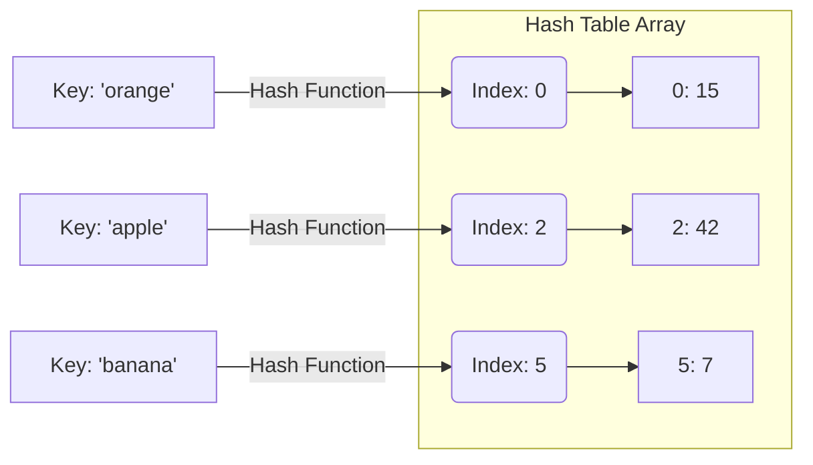

# 08 - Core Array & Hashing Problems

## Core Concepts

Arrays and Hash Maps (Dictionaries in Python) are the most fundamental data structures in technical interviews. They form the foundation for more complex patterns.

### Arrays
An array is a contiguous block of memory. Lookups by index are $O(1)$, but inserting or deleting elements in the middle requires shifting elements, which takes $O(n)$ time.

### Hash Maps
A Hash Map (or Hash Table) maps keys to values for highly efficient lookups. Under the hood, it uses a hash function to compute an index into an array of buckets or slots. 
- **Time Complexity**: Average $O(1)$ for insertion, deletion, and search.
- **Space Complexity**: $O(n)$ to store the key-value pairs.

## Common Patterns

1. **Frequency Counting**: Use a dictionary (or `collections.defaultdict`, `collections.Counter`) to count occurrences of elements. This is highly useful for checking duplicates, anagrams, or palindromes.
2. **Two Sum Pattern**: Instead of a nested loop $O(n^2)$ to find pairs, use a Hash Map to store the elements you've already seen. For every element `x`, check if `target - x` is in the Hash Map $O(n)$.
3. **In-Place Array Manipulation**: If memory is strict ($O(1)$ space), you can sometimes use the array itself as a hash map by negating values or adding multiples of `n` to the values at corresponding indices.

## Diagram: Hash Map Concept

## Cheat Sheet: When to apply Hash Maps?

> [!TIP]
> - Do you need to **look up** elements in $O(1)$ time? -> Use a `set` or `dict`.
> - Do you need to **count frequencies**? -> Use a `dict` or `Counter`.
> - Do you need to find **pairs or relationships** between elements without sorting? -> Use a `dict` to store previously seen elements.
> - Are you looking for a **Consecutive Sequence**? -> Put elements in a `set` and only start counting from numbers that have no left neighbor (`num - 1 not in set`).

> [!WARNING]
> Remember that `dict` and `set` operations are $O(1)$ on *average*, but they require extra $O(n)$ space. If a problem strictly enforces $O(1)$ space, you may need to sort the array first or use Two Pointers.
