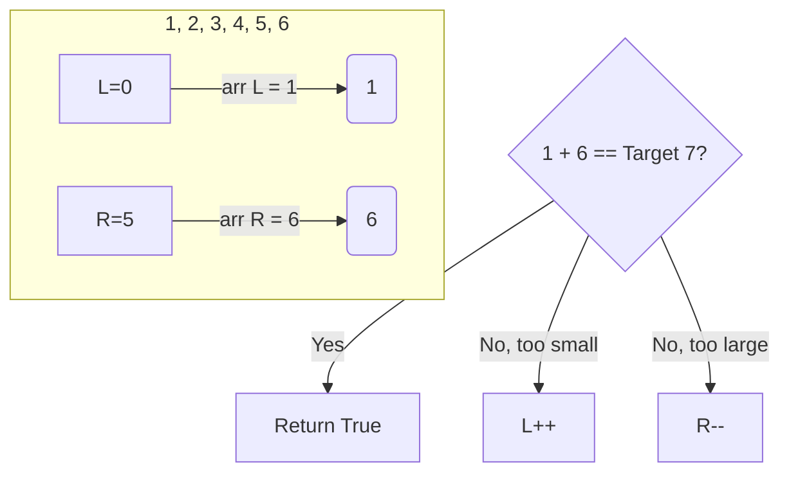

# 09 - Two Pointers and Window Patterns

## Core Concepts

The Two Pointers technique involves using two index variables to traverse a data structure (usually an array or string) simultaneously. This is often used to avoid nested loops, reducing $O(n^2)$ time complexity to $O(n)$.

## Pointer Movement Patterns

### 1. Opposite Ends (Converging)
Used heavily for finding pairs or bounding volumes when the array is **sorted** or you need to evaluate extreme ends.
- **Start**: `left = 0`, `right = len(arr) - 1`
- **Movement**: If the current state is "too small", increment `left`. If the current state is "too large", decrement `right`.
- **Stop**: When `left >= right`.

### 2. Same Direction (Fast/Slow Pointers)
Used for in-place array modifications (compaction, removing duplicates) or detecting cycles.
- **Start**: `slow = 0`, `fast = 1`
- **Movement**: `fast` always increments. `slow` only increments when a condition is met (e.g., finding a unique element).

## Diagrams

### Opposite Ends Pattern (Target Sum)


### Same Direction Pattern (Remove Duplicates)
```mermaid
graph TD
    subgraph Array [1, 1, 2, 3, 3]
        S[Slow=0] --> |Confirmed Unique| V1_1(1)
        F[Fast=1] --> |Scout| V1_2(1)
    end
    Condition{arr[Fast] == arr[Slow]?}
    Condition --> |Yes| Skip[Fast++]
    Condition --> |No| Keep[Slow++, arr_Slow = arr_Fast, Fast++]
```

## Cheat Sheet: When to apply Two Pointers?

> [!TIP]
> - Is the array **sorted**? -> Strong indicator for opposite-end pointers.
> - Do you need to find a **pair** (sum, difference)? -> Sort it, then use opposite pointers.
> - Do you need to track **boundaries**? (e.g., Container with Most Water) -> Opposite ends, move the pointer that is "limiting" the boundary (the shorter side).
> - Do you need to perform an **in-place modification** (e.g., removing duplicates, moving zeros to the end)? -> Same direction (Fast/Slow) pointers.

> [!WARNING]
> Two Pointers from opposite ends *relies* on the array being sorted to make logical decisions about which pointer to move. If the array isn't sorted, sorting it takes $O(n \log n)$, which might be worse than a Hash Map solution which is $O(n)$. Always weigh Sorting + Two Pointers vs Hash Map!
