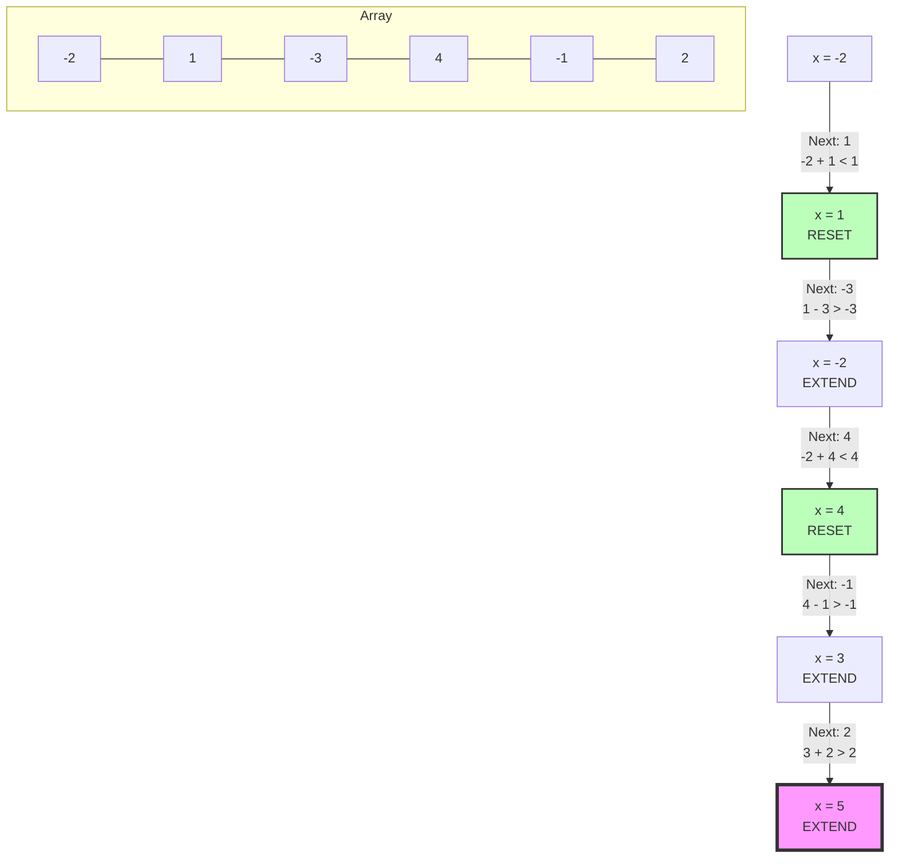

# 11 - Kadane's Algorithm and Subarray Patterns

## Core Concepts

A **subarray** is a contiguous block of elements within an array. It cannot skip elements (unlike a subsequence) and must maintain the original order.
- Total number of subarrays in an array of size $n$: $\frac{n(n+1)}{2}$.

### Prefix Sums
A prefix sum array stores the cumulative sum of elements up to each index.
- **Formula**: `prefix[i] = prefix[i-1] + arr[i]`
- **Usage**: Once built in $O(n)$ time and $O(n)$ space, you can find the sum of *any* subarray `arr[i...j]` in $O(1)$ time.
- **Query Formula**: `sum(i, j) = prefix[j] - prefix[i-1]` (if `i == 0`, just `prefix[j]`).

### Kadane's Algorithm
Kadane's algorithm is a dynamic programming approach to find the **Maximum Subarray Sum** in strictly $O(n)$ time and $O(1)$ space.

The core intuition is to ask at each step:
> "Is it better to **EXTEND** the previous subarray by including `arr[i]`, or to **START FRESH** at `arr[i]`?"

If the running sum so far is negative, it will only drag down future sums. Therefore, we "reset" the running sum and start fresh from the current element.

## Diagram: Kadane's "Extend or Reset"

*Pink box indicates the overall maximum found (`max_so_far = 5`).*

## Cheat Sheet: Subarray Patterns

> [!TIP]
> - Need to query sums of ranges frequently? -> Build a **Prefix Sum** array.
> - Need the **Maximum/Minimum Subarray Sum**? -> **Kadane's Algorithm** $O(n)$.
> - Does the array "wrap around" (Circular)? -> Find the max subarray, then find the min subarray. The answer is `max(max_normal, total_sum - min_normal)`.

> [!WARNING]
> Generating all subarrays takes $O(n^2)$ time just for the loop, but actually *printing* or *slicing* them takes $O(n^3)$ because copying the slice takes $O(k)$ time per subarray. Never generate all subarrays unless specifically asked or $n$ is very small.
