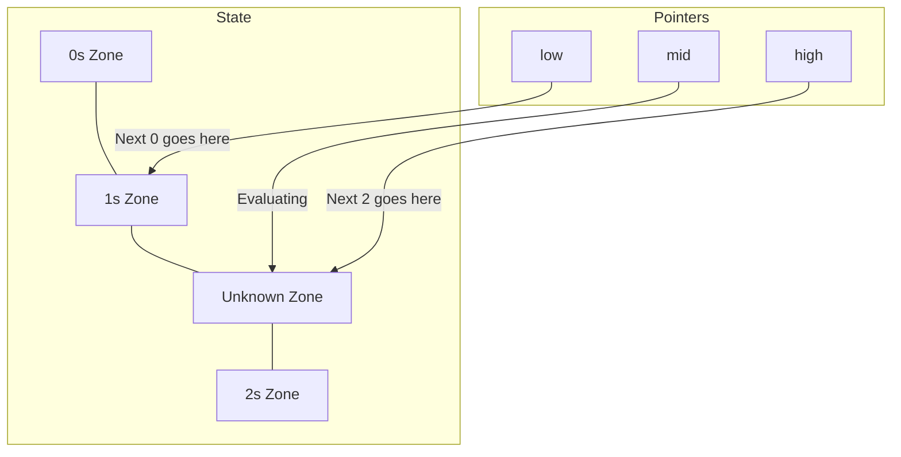

# 12 - Classical Sorting Algorithms

## Core Concepts

Sorting is a foundational operation. While you will almost always use Python's built-in `list.sort()` or `sorted()` in interviews ($O(n \log n)$ time, Timsort algorithm), understanding basic sorting algorithms and specific linear-time sorts is critical for specific patterns.

### Stability
A sorting algorithm is **stable** if it preserves the relative order of equal elements. 
- Example: Sorting `[(A, 3), (B, 1), (C, 3)]` by number. A stable sort guarantees `(A, 3)` stays before `(C, 3)`.

### Basic $O(n^2)$ Sorts
- **Selection Sort**: Find the minimum in the unsorted portion and swap it with the first unsorted element. (Unstable)
- **Bubble Sort**: Repeatedly swap adjacent elements if they are in the wrong order. Heaviest elements "bubble" to the end. (Stable)
- **Insertion Sort**: Build the sorted array one element at a time by shifting elements to make room. Very fast for nearly-sorted arrays. (Stable)

## Specialized $O(n)$ Sorts

### DNF Sort (Dutch National Flag)
Used to sort an array containing exactly 3 distinct values (e.g., 0, 1, 2).
It uses three pointers (`low`, `mid`, `high`) to partition the array into 3 zones in a single pass.
- **Time Complexity**: $O(n)$
- **Space Complexity**: $O(1)$

### Counting Sort
Used when the elements are integers within a specific, small range ($K$). It counts occurrences of each element rather than comparing them.
- **Time Complexity**: $O(n + K)$
- **Space Complexity**: $O(K)$

## Diagram: Dutch National Flag Sort

- If `arr[mid] == 0`: swap `arr[low]` and `arr[mid]`, increment both.
- If `arr[mid] == 1`: increment `mid`.
- If `arr[mid] == 2`: swap `arr[mid]` and `arr[high]`, decrement `high`.

## Cheat Sheet: Which sort to use?

> [!TIP]
> - "Sort an array of 0s, 1s, and 2s" -> **DNF Sort** $O(n)$.
> - "Sort an array where elements are between 1 and 100" -> **Counting Sort** $O(n)$.
> - "Is there a built-in function?" -> Always use `arr.sort()` unless the problem restricts it.
